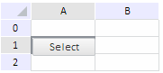
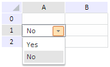

# TabSheet.CellEditorRendered

TabSheet.CellEditorRendered
-

# TabSheet.CellEditorRendered

## Синтаксис

CellEditorRendered: PP.Delegate | function (sender,
 args)

## Параметры

sender. Источник события;

args. Информация о событии.

## Описание

Событие CellEditorRendered наступает
 после отрисовки редактора для ввода значения ячейки.

## Комментарии

Редактор отрисовывается при двойном щелчке по ячейке таблицы, для которой
 заданы соответствующие настройки.

## Пример

Для выполнения примера добавьте ссылки на файлы PP.css, PP.js и PP.TabSheet.js.
 Предполагается наличие файла tabSheetJSON.js с настройками источника данных
 таблицы.

[Содержимое файла
 tabSheetJSON.js](javascript:TextPopup(this))

data = {
   "Structure": {
      "@MUR": 2,
      "@MUC": 1,
      "DefaultRow": {
         "@H": 19
      },
      "DefaultColumn": {
         "@W": 71
      }
   },
   "Styles": {

      "Style": [{
         "@B": "{\"UI\":\"ComboBox\", \"ListBox\": {\"Items\":[{ \"Content\":\"Yes\", \"Value\":\"CTRL_YES\" },{ \"Content\":\"No\", \"Value\":\"CTRL_NO\", \"Selected\": true }]}}"
      }]
   }
};

Добавим на страницу таблицу и настроим для всех её ячеек отображение
 редактора для выбора значений из раскрывающегося списка при двойном щелчке
 мыши:

    //подключаем скрипт с настройками источника таблицы
    PP.ScriptManager.loadScripts(["tabSheetJSON.js"], tbsht);
    function tbsht() {
        if (!data)
            return false;
        if (!PP.Ui.ExamplePrognozSyncDataSource) {
            PP.Ui.ExamplePrognozSyncDataSource = function (clear) {
                this.MeasuresLoaded = new PP.Delegate();
                this.RangeLoaded = new PP.Delegate();
            };
            //Инициализация класса-источника данных таблицы
            PP.initClass(PP.Ui.ExamplePrognozSyncDataSource, PP.Object, "PP.Ui.ExamplePrognozSyncDataSource", [PP.Ui.ITabSheetDataSource]);
            var esdsProto = PP.Ui.ExamplePrognozSyncDataSource.prototype;
            esdsProto.getIsAsync = function () {
                return false;
            };
            esdsProto.loadMeasures = function () {
                this.MeasuresLoaded.fire(this, {
                    Data: data
                });
            };

            esdsProto.loadRanges = function (rangeArray) {
                this.RangeLoaded.fire(this, {
                    Data: data,
                    Ranges: rangeArray
                });
            };
            esdsProto = null;
        }
        //Создаем экземпляр класса PP.Ui.ExamplePrognozSyncDataSource
        dataSource = new PP.Ui.ExamplePrognozSyncDataSource();
        //Кнопка для вызова редактора ячейки
        button1 = new PP.Ui.ToolBarButton({
            Width: 70,
            Height: 20,
            Content: "Select"
        });
        component = new PP.Ui.TabSheet({

            ParentNode: container,
            DataSource: dataSource,
            IsEditable: true,
            Width: 400,
            Height: 250,
            //Кнопка для вызова редактора ячейки
            SelectionControl: {
                Control: button1,
                Position: PP.Ui.TSSelControlPos.TopLeft,
                Width: 50,
                Height: 50
            },
            CellEditorRendered: function (sender, args) {
                alert("Select a value")
            }
        });
    };
После выполнения примера на странице будет размещен компонент [TabSheet](TabSheet.htm),
 состоящий из 3 строк и 2 столбцов. При нажатии на ячейку таблицы появится
 кнопка «Select»:

При двойном щелчке по кнопке (если пример без кнопки, то при двойном
 щелчке по ячейке таблицы) на экран будет выведено сообщение «Select a
 value» и откроется комбинированный список для выбора значения:

См. также:

[TabSheet](TabSheet.htm)

		Справочная
		 система на версию 10.9
		 от 18/08/2025,
		 © ООО «ФОРСАЙТ»,
