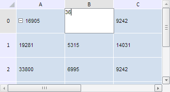

# TabSheet.Edited

TabSheet.Edited
-

# TabSheet.Edited

## Синтаксис

Edited: function (sender, args);

## Параметры

sender. Источник события;

args. Информация о событии. Доступные аргументы: after - массив ячеек таблицы после их редактирования, before - массив ячеек таблицы до их редактирования, type - тип редактируемых объектов, method - метод редактирования таблицы, определяемый с помощью перечисления PP.Ui.TabEditMethod.

## Описание

Событие Edited наступает после редактирования ячейки таблицы.

## Комментарии

Данное событие доступно, если существует возможность выделения ячеек таблицы.

## Пример

Для выполнения примера необходимо наличие на html-странице компонента [TabSheet](../../../Components/TabSheet/TabSheet/TabSheet.htm) с наименованием «tabSheet» (см. «[Пример создания компонента TabSheet](../../../Components/TabSheet/TabSheet/TabSheet_Example.htm)»). Обработаем событие процесса редактирования ячейки Editing и событие окончания данного процесса Edited:

// Обработаем событие Edited
tabSheet.Edited.add(function (sender, args) {
    console.log("Ячейка отредактирована.");
    // Получим копию ячейки таблицы после редактирования
    var after = args.after[0];
    console.log("Новое значение ячейки: " + after.getValue())
});
// Обработаем событие Editing
tabSheet.Editing.add(function (sender, args) {
    console.log("Редактирование ячейки...");
    // Получаем координаты редактируемой ячейки
    var coord = args.Cell.getCoord();
    console.log("Координаты ячейки: (" + coord.rowIndex + ", " + coord.colIndex + ")")
});

Выполним данный пример. Затем дважды щёлкнем по ячейке таблицы B0 и введём в неё новое значение, равное 36:

Далее подтвердим ввод. Тогда в консоли браузера будут выведены координаты отредактированной ячейки и её новое значение:

Редактирование ячейки...

Координаты ячейки: (0, 1)

Ячейка отредактирована.

Новое значение ячейки: 36

См. также:

[TabSheet](TabSheet.htm)

		Справочная
		 система на версию 10.9
		 от 18/08/2025,
		 © ООО «ФОРСАЙТ»,
