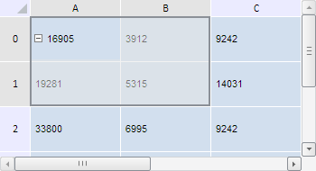

# TabSheet.SelectionBegin

TabSheet.SelectionBegin
-

# TabSheet.SelectionBegin

## Синтаксис

SelectionBegin: function (sender, args);

## Параметры

sender. Источник события;

args. Информация о событии.

## Описание

Событие SelectionBegin генерируется в начале процесса выделения ячеек таблицы.

## Комментарии

Данное событие доступно, если существует возможность выделения ячеек таблицы.

## Пример

Для выполнения примера необходимо наличие на html-странице компонента [TabSheet](../../../Components/TabSheet/TabSheet/TabSheet.htm) с наименованием «tabSheet» (см. «[Пример создания компонента TabSheet](../../../Components/TabSheet/TabSheet/TabSheet_Example.htm)»). Обработаем событие начала выделения ячеек SelectionBegin, событие изменения области выделения SelectionChanging, а также событие окончания процесса изменения области выделения SelectionChanged:

// Обработаем событие SelectionBegin
tabSheet.SelectionBegin.add(function (sender, args) {
    console.log("Процесс выделения ячеек начат.")
});
// Обработаем событие SelectionChanging
tabSheet.SelectionChanging.add(function (sender, args) {
    console.log("Идёт процесс выделения ячеек...");
    var tlCoord = args.getRange().getCorners().tlCoord;
    var brCoord = args.getRange().getCorners().brCoord;
    console.log("(" + tlCoord.rowIndex + ", " + tlCoord.colIndex + ")-" + "(" + brCoord.rowIndex + ", " + brCoord.colIndex + ")")
});
// Обработаем событие SelectionChanged
tabSheet.SelectionChanged.add(function (sender, args) {
    console.log("Процесс выделения ячеек закончен.");
    var size = args.getRange().getSizeInCells();
    var cellsCount = size.rowsCount * size.columnsCount;
    console.log("Количество выделенных ячеек: " + cellsCount)
});

Выполним данный пример. Затем выделим ячейку A0 и, не отпуская кнопку мыши, проведём курсором последовательно по ячейкам A1 и B1. Таким образом, будет выделен диапазон, как показано на следующем рисунке:

При этом в консоли браузера будут выведены уведомления о наступлении всех трёх обработанных событий. В процессе выделения ячеек также будут выведены координаты текущего активного диапазона, а после выделения - общее количество выделенных ячеек:

Идёт процесс выделения ячеек...

(0, 0)-(0, 0)

Процесс выделения ячеек начат.

Идёт процесс выделения ячеек...

(0, 0)-(1, 0)

Идёт процесс выделения ячеек...

(0, 0)-(1, 1)

Процесс выделения ячеек закончен.

Количество выделенных ячеек: 4

См. также:

[TabSheet](TabSheet.htm)

		Справочная
		 система на версию 10.9
		 от 18/08/2025,
		 © ООО «ФОРСАЙТ»,
