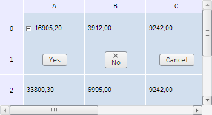
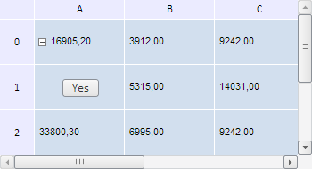

# TabSheet.addCellControl

TabSheet.addCellControl
-

**

# TabSheet.addCellControl

## Синтаксис

addCellControl(control: [PP.Ui.Control](dhtmlUi.chm::/Classes/control/control.htm),
 coord: [PP.Ui.TabSheetCoord](../TabSheetCoord/TabSheetCoord.htm),
 coord: [PP.Ui.TabSheetCoord](../TabSheetCoord/TabSheetCoord.htm));

## Параметры

*control.* Добавляемый
 элемент управления;

*coord.* Координаты ячейки, в которую
 добавляется элемент управления.

## Описание

Метод addCellControl**
 добавляет элемент управления в ячейку с указанными координатами.

## Комментарии

Элемент управления, уже существующий в ячейке с указанными координатами,
 будет заменен.

Метод возвращает значение true
 в случае успешного добавления элемента управления в ячейку.

## Пример

Для выполнения примера необходимо наличие на html-странице компонента
 [TabSheet](../../../Components/TabSheet/TabSheet/TabSheet.htm)
 с наименованием «tabSheet» (см. «[Пример
 создания компонента TabSheet](../../../Components/TabSheet/TabSheet/TabSheet_Example.htm)»). Добавим в ячейки таблицы с координатами
 (0, 0), (0, 1) и (0, 2) три кнопки с надписями «Yes», «No» и «Cancel»
 соответственно. Для кнопки «No» установим также картинку:

// Добавим две кнопки с надписями «No» и «Cancel»
tabSheet.setCellControls([{Control: new PP.Ui.Button({ Content: "No"}), Coord: tabSheet.getCoord(1, 1)},
{Control: new PP.Ui.Button({ Content: "Cancel"}), Coord: tabSheet.getCoord(1, 2)}]);
// Добавим кнопку «OK»
tabSheet.addCellControl(new PP.Ui.Button({Content: "Yes"}), tabSheet.getCoord(1, 0));
// Получим кнопку «No» и установим изображение для неё
var button = tabSheet.getCellControl(tabSheet.getCoord(1, 1));
button.setImageUrl("build/img/w_close.png");

В результате выполнения примера в указанные ячейки таблицы будут добавлены
 кнопки:

Затем удалим из ячеек таблицы кнопки «Cancel» и «No»:

// Удалим кнопку «Cancel» по её координате
var coord = tabSheet.getCoord(1, 2);
var index = tabSheet.getCellControlIndex(coord);
if (index !== false) {
    tabSheet.removeCellControlByIndex(index);
} else {
    console.log("В ячейке с координатами (" + coord.rowIndex + ", " + coord.colIndex +  ") элемент управления не обнаружен.");
}
// Удалим кнопку «No» с помощью специального метода
tabSheet.removeCellControl(tabSheet.getCoord(1, 1));
В результате выполнения данного примера в таблице будут удалены кнопки
 «Cancel» и «No»:

Таким образом, осталась одна кнопка. Удалим все оставшиеся элементы
 управления в таблице:

tabSheet.removeAllCellControl();

В результате выполнения данной строки кода будут удалены все элементы
 управления в ячейках таблицы:

См. также:

[TabSheet](TabSheet.htm)

		Справочная
		 система на версию 10.9
		 от 18/08/2025,
		 © ООО «ФОРСАЙТ»,
