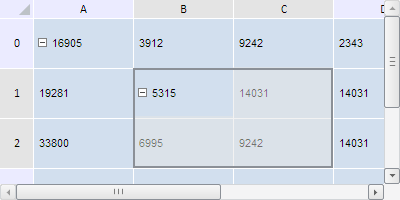

# TabSheet.addExpander

TabSheet.addExpander
-

**

# TabSheet.addExpander

## Синтаксис

addExpander(range: PP.Ui.[TabSheetRange](../TabSheetRange/TabSheetRange.htm), noValidation: Boolean, isCollapse: Boolean);

## Параметры

*range.* Диапазон, расширяемый с помощью кнопки разворачивания;

*noValidation.* Признак отсутствия проверки на вложенность расширяемых диапазонов. Если параметр равен true, то данная проверка будет отключена, иначе - включена.

*isCollapse.* Признак свёртывания расширяемого диапазона. Если параметр равен true, то данный диапазон будет свёрнут, иначе - развёрнут.

## Описание

Метод addExpander** добавляет кнопку развёртывания для диапазона в его верхней левой ячейке.

## Комментарии

При свёрнутом состоянии кнопки развёртывания скрываются все ячейки диапазона, кроме ячейки, в котором находится сама кнопка.

Метод возвращает объект типа PP.Ui.[TabSheetExpander](../TabSheetExpander/TabSheetExpander.htm).

## Пример

Для выполнения примера необходимо наличие на html-странице компонента с наименованием «tabSheet» (см. «[Пример создания компонента TabSheet](../../../Components/TabSheet/TabSheet/TabSheet_Example.htm)»). Добавим кнопку развёртывания по заданному диапазону, развернём его и выделим:

// Получим диапазон ячеек по заданным координатам
var range = tabSheet.getRange(1, 2, 2, 1);
// Добавим экспандер по заданному диапазону
var expander = tabSheet.addExpander(range, false, false);
// Развернём диапазон
tabSheet.getExpanderUnderCoord(expander.getCoord()).setIsCollapsed(false);
// Выделим расширяемый диапазон
tabSheet.select(range);
// Увеличим размеры таблицы
tabSheet.setSize(400, 200);
// Обновим таблицу
tabSheet.rerender();

В результате выполнения примера была добавлена кнопка развёртывания по диапазону (1, 2, 2, 1), а сам диапазон был развёрнут и выделен:

См. также:

[TabSheet](TabSheet.htm)

		Справочная
		 система на версию 10.9
		 от 18/08/2025,
		 © ООО «ФОРСАЙТ»,
