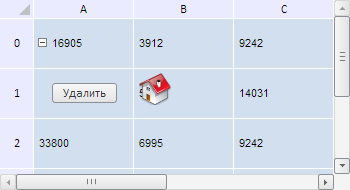

# TabSheet.addObject

TabSheet.addObject
-

**

# TabSheet.addObject

## Синтаксис

addObject(data: PP.Ui.[TabSheetObject](../TabSheetObject/TabSheetObject.htm));

## Параметры

*data.* Данные добавляемого объекта.

## Описание

Метод addObject** добавляет объект в таблицу.

## Пример

Для выполнения примера необходимо наличие на html-странице компонента [TabSheet](../../../Components/TabSheet/TabSheet/TabSheet.htm) с наименованием «tabSheet» (см. «[Пример создания компонента TabSheet](../../../Components/TabSheet/TabSheet/TabSheet_Example.htm)»). В папке с данной html-страницей должна существовать папка «img» с графическим файлом «home.png». Добавим данное изображение в качестве объекта в таблицу, разрешим его перемещение, обработаем событие нажатия по данному объекту и добавим кнопку для его удаления:

// Создадим новый объект для таблицы
var tabSheetObject = new PP.Ui.TabSheetObject({
    Data: {
        "@TR": 1, // Индекс строки ячейки, в область которой вставляем объект
        "@LC": 1, // Индекс столбца ячейки, в область которой вставляем объект
        "@T": 5, // Отступ сверху
        "@L": 5, // Отступ слева
        "@H": 32, // Высота объекта
        "@W": 32 // Ширина объекта
    },
    Parent: tabSheet
});
// Укажем адрес к картинке
tabSheetObject.setUrl("img/home.png");
// Разрешим перемещать объект
tabSheet.setEnableMoveObjects(true);
// Обработаем событие MouseDown
tabSheet.MouseDown.add(function (sender, eventArgs) {
    var ts = tabSheetObject.getTabSheet();
    // Получим выделенные объекты
    var objectSelection = ts.getObjectSelection();
    if (!ts.getEnableMoveObjects()) {
        // Сбросим выделение объекта в таблице
        objectSelection.reset()
    } else {
        // Обновим выделенные объекты
        objectSelection.update()
    };
    return false
});
// Добавим объект в таблицу
tabSheet.addObject(tabSheetObject);
// Добавим кнопку для удаления объекта
var button = new PP.Ui.Button({
    Content: "Удалить"
});
var coord = tabSheet.coord(1, 0)
button.Click.add(function () {
    // Удалим все объекты в таблице
    tabSheet.getModel().eachObject(function (object) {
        tabSheet.removeObject(object);
    }, this);
    // Удалим кнопку
    tabSheet.removeCellControl(coord);
    tabSheet.rerender()
});
// Добавляем кнопку в таблицу
tabSheet.addCellControl(button, coord);
// Обновим таблицу
tabSheet.rerender();

В результате выполнения примера в таблицу был вставлен объект с изображением, было разрешено его перемещение, обработано событие нажатия по данному объекту MouseDown, при наступлении которого выделенный объект будет обновляться, а также была добавлена кнопка для его удаления:

После нажатия на кнопку будет удалён и сам объект, и сама кнопка:

См. также:

[TabSheet](TabSheet.htm)

		Справочная
		 система на версию 10.9
		 от 18/08/2025,
		 © ООО «ФОРСАЙТ»,
