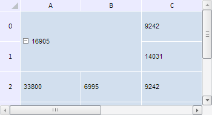

# TabSheet.calcCoordByOffset

TabSheet.calcCoordByOffset
-

**

# TabSheet.calcCoordByOffset

## Синтаксис

calcCoordByOffset(left: Number, top: Number, isVirtual: Boolean);

## Параметры

*left.* Сдвиг слева;

*top.* Сдвиг сверху;

*isVirtual.* Признак, показывающий, какие координаты переданы - виртуальные или реальные. Если параметр равен true, то возвращаемые координаты являются виртуальными, иначе - реальными.

## Описание

Метод calcCoordByOffset** возвращает координаты, соответствующие сдвигу относительно верхнего правого угла таблицы с учётом объединения ячеек.

## Комментарии

Метод возвращает объект типа PP.Ui.[TabSheetCoord](../TabSheetCoord/TabSheetCoord.htm).

## Пример

Для выполнения примера необходимо наличие на html-странице компонента [TabSheet](../../../Components/TabSheet/TabSheet/TabSheet.htm) с наименованием «tabSheet» (см. «[Пример создания компонента TabSheet](../../../Components/TabSheet/TabSheet/TabSheet_Example.htm)»). Объединим ячейки и получим координаты, соответствующие сдвигу на одну ячейку вправо и одну ячейку вниз без учётом объединения ячеек:

// Получим диапазон ячеек по заданным координатам
var range = tabSheet.getRange(0, 1, 1, 0);
// Выполним объединение ячеек по полученному диапазону
tabSheet.merge(range);
// Получим измерения таблицы
var measure = tabSheet.getMeasures();
/* Вычислим координаты сдвига на одну ячейку вправо и одну ячейку вниз,
учитывая размеры заголовков строк и столбцов */
var caclWidth = measure.getRowHeaderWidth() + tabSheet.getColumnWidth(0) + 2;
var caclHeight = measure.getHeaderHeight() + tabSheet.getRowHeight(0) + 2;
// Получим координаты ячейки, соответствующие сдвигу с учётом объединения ячеек
var tabSheetCoord = tabSheet.calcCoordByOffset(caclWidth, caclHeight, false);
// Выведем полученные координаты
console.log("Координаты ячейки: (" + tabSheetCoord.rowIndex + ", " + tabSheetCoord.colIndex + ")");

В результате выполнения примера были объединены ячейки, входящие в диапазон (0, 1, 1, 0):

Поскольку сдвиг соответствует диапазону объединённых ячеек, то в консоли браузера были выведены координаты верхней левой ячейки из данного диапазона.

Координаты ячейки: (0, 0)

См. также:

[TabSheet](TabSheet.htm)

		Справочная
		 система на версию 10.9
		 от 18/08/2025,
		 © ООО «ФОРСАЙТ»,
