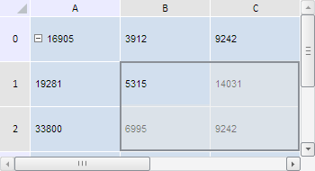

# TabSheet.clearSelection

TabSheet.clearSelection
-

**

# TabSheet.clearSelection

## Синтаксис

clearSelection();

## Описание

Метод clearSelection** убирает все выделения в таблице.

## Пример

Для выполнения примера необходимо наличие на html-странице компонента [TabSheet](../../../Components/TabSheet/TabSheet/TabSheet.htm) с наименованием «tabSheet» (см. «[Пример создания компонента TabSheet](../../../Components/TabSheet/TabSheet/TabSheet_Example.htm)»). Выделим диапазон ячеек, а затем уберём данное выделение:

// Получим диапазон ячеек по заданным координатам
var range = tabSheet.getRange(1, 2, 2, 1);
// Выберем диапазон
range.select();
var isClear = confirm("Убрать все выделения?");
if (isClear) {
    // Убираем все выделения
    tabSheet.clearSelection()
};

В результате выполнения данного примера был выделен диапазон ячеек (1, 2, 2, 1):

Также был выведен диалог, запрашивающий подтверждение на снятие данного выделения. После нажатия на кнопку «OK» выделение ячеек будет убрано:

См. также:

[TabSheet](TabSheet.htm)

		Справочная
		 система на версию 10.9
		 от 18/08/2025,
		 © ООО «ФОРСАЙТ»,
