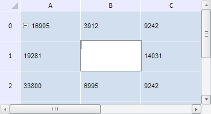

# TabSheet.edit

TabSheet.edit
-

**

# TabSheet.edit

## Синтаксис

edit(rowIndex: Number, colIndex: Number);

## Параметры

*rowIndex.* Индекс строки ячейки;

*colIndex.* Индекс столбца ячейки.

## Описание

Метод edit** переводит ячейку в режим редактирования.

## Пример

Для выполнения примера необходимо наличие на html-странице компонента [TabSheet](../../../Components/TabSheet/TabSheet/TabSheet.htm) с наименованием «tabSheet» (см. «[Пример создания компонента TabSheet](../../../Components/TabSheet/TabSheet/TabSheet_Example.htm)»). Разрешим редактирование диапазона ячеек и начнём редактирование ячейки с координатами (1, 1):

// Получим объект типа TabSheetCoord
var coord = tabSheet.coord(1, 1);
// Получим диапазон ячеек по заданным координатам
var range = tabSheet.getRange(0, 1, 1, 0);
// Установим специальный режим редактирования ячеек таблицы
tabSheet.setIsEditable(PP.Ui.TabSheetEditMode.UserEnabledCell);
// Разрешим редактирование диапазона ячеек
tabSheet.setIsUserEditableRanges(range);
// Переведём ячейку в режим редактирования
tabSheet.edit(coord);
// Получим информацию о текущем активном редакторе ячейки
var isEdit = confirm("Разрешить редактирования ячейки (" + coord.colIndex + ", " + coord.rowIndex + ") ?");
if (isEdit) {
    var cellEditorInfo = tabSheet.getCurrentCellEditor();
    console.log("Редактор открыт для ячейки (" + cellEditorInfo.getCoord().colIndex + ", " + cellEditorInfo.getCoord().rowIndex + ")");
} else {
    // Закрываем окно редактора ячейки
    tabSheet.closeCellEditor();
    // Сгенерируем событие Edited
    tabSheet.doEdit(tabSheet.getModel().getCell(coord), null)
};
// Очистим информацию о массиве ячеек, которые были отредактированы пользователем
tabSheet.clearUserEditableRanges();

В результате выполнения примера было начато редактирование ячейки с координатами (1, 1). При этом появилось окно, запрашивающее разрешение на редактирования ячейки. Для продолжения нажмём на кнопку «OK»:

При этом в консоли браузера было выведено соответствующее сообщение:

Редактор открыт для ячейки (1, 1)

В случае нажатия кнопки «Отмена» редактор ячейки закроется.

См. также:

[TabSheet](TabSheet.htm)

		Справочная
		 система на версию 10.9
		 от 18/08/2025,
		 © ООО «ФОРСАЙТ»,
