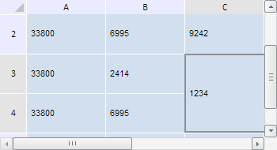

# TabSheet.ensureCellSpanUnderCoordVisibility

TabSheet.ensureCellSpanUnderCoordVisibility
-

**

# TabSheet.ensureCellSpanUnderCoordVisibility

## Синтаксис

ensureCellSpanUnderCoordVisibility(coord: PP.Ui.[TabSheetCoord](../TabSheetCoord/TabSheetCoord.htm));

## Параметры

*coord.* Координата внутри диапазона объединённых ячеек.

## Описание

Метод ensureCellSpanUnderCoordVisibility** изменяет видимую область таблицы так, чтобы отображался диапазон объединённых ячеек.

## Пример

Для выполнения примера необходимо наличие на html-странице компонента [TabSheet](../../../Components/TabSheet/TabSheet/TabSheet.htm) с наименованием «tabSheet» (см. «[Пример создания компонента TabSheet](../../../Components/TabSheet/TabSheet/TabSheet_Example.htm)»). Создадим диапазон объединённых ячеек, выделим его и изменим видимую область таблицы так, чтобы данный диапазон отображался:

// Получим диапазон ячеек по заданным координатам
var range = tabSheet.getRange(2, 4, 3, 3);
// Выполним объединение ячеек по полученному диапазону
tabSheet.merge(range);
// Выделим диапазон
range.select();
// Получим диапазон объединённых ячеек
var span = tabSheet.getCellSpanUnderCoord(tabSheet.getSelectedCoord());
if (tabSheet.isCellSpanVisible(span)) {
    // Убедимся, что объединение под координатой находится в видимой области
    tabSheet.ensureCellSpanUnderCoordVisibility(span.getCoord())
};

В результате выполнения примера был создан, выделен и показан в видимой области таблицы диапазон объединенных ячеек:

См. также:

[TabSheet](TabSheet.htm)

		Справочная
		 система на версию 10.9
		 от 18/08/2025,
		 © ООО «ФОРСАЙТ»,
