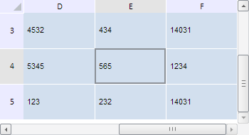

# TabSheet.ensureCoordVisibility

TabSheet.ensureCoordVisibility
-

**

# TabSheet.ensureCoordVisibility

## Синтаксис

ensureCoordVisibility(coord: PP.Ui.[TabSheetCoord](../TabSheetCoord/TabSheetCoord.htm));

## Параметры

*coord.* Координаты ячейки, которую нужно отобразить в видимой области таблицы.

## Описание

Метод ensureCoordVisibility** изменяет видимую область таблицы так, чтобы отображалась ячейка с указанными координатами.

## Пример

Для выполнения примера необходимо наличие на html-странице компонента [TabSheet](../../../Components/TabSheet/TabSheet/TabSheet.htm) с наименованием «tabSheet» (см. «[Пример создания компонента TabSheet](../../../Components/TabSheet/TabSheet/TabSheet_Example.htm)»). Выделим ячейку таблицы с координатами (4, 4) и изменим видимую область таблицы так, чтобы данная ячейка отображалась:

// Получим объект типа TabSheetCoord
var coord = tabSheet.coord(4, 4);
tabSheet.getCell(coord.rowIndex, coord.colIndex).select();
// Убедимся, что координата находится в видимой области
if (!tabSheet.isCoordVisible(coord)) {
    tabSheet.ensureCoordVisibility(coord)
};

В результате выполнения примера ячейка с координатами (4, 4) была выделена и размещена в видимой области таблицы:

См. также:

[TabSheet](TabSheet.htm)

		Справочная
		 система на версию 10.9
		 от 18/08/2025,
		 © ООО «ФОРСАЙТ»,
