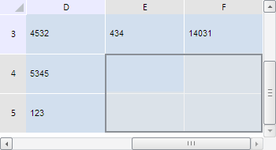

# TabSheet.ensureCurrentSelectionVisibility

TabSheet.ensureCurrentSelectionVisibility
-

**

# TabSheet.ensureCurrentSelectionVisibility

## Синтаксис

ensureCurrentSelectionVisibility();

## Описание

Метод ensureCurrentSelectionVisibility** изменяет видимую область таблицы так, чтобы отображалось выделение.

## Пример

Для выполнения примера необходимо наличие на html-странице компонента
 [TabSheet](../../../Components/TabSheet/TabSheet/TabSheet.htm)
 с наименованием «tabSheet» (см. «[Пример
 создания компонента TabSheet](../../../Components/TabSheet/TabSheet/TabSheet_Example.htm)»). Выделим диапазон, изменим видимую
 область в таблице в соответствии с данным выделением, вырежем его и выведем
 затем данные диапазона в консоли браузера:

// Получим диапазон ячеек по заданным координатам
var range = tabSheet.getRange(4, 4, 5, 5);
// Выберем диапазон
range.select();
// Убедимся, что выделение находится в видимой области
tabSheet.ensureCurrentSelectionVisibility();
// Получаем данные выделенного диапазона
var values = tabSheet.copy();
// Заново запросим все данные из источника данных
tabSheet.reset(tabSheet.getModel().getDataSource());
// Проверим, находятся ли вырезанные данные в буфере
if (tabSheet.getClipboardContainsData()) {
    console.log("Данные, находящиеся в буфере: \r\n" + cutedRange)
} else {
    console.log("В буфере нет данных.")
};

В результате выполнения примера диапазон (4, 4, 5, 5) был
 выделен и размещён в видимой области таблицы:

Данные этого диапазона были вырезаны и выведены в консоли браузера:

Данные, находящиеся в буфере:

565 1234

232 14031

См. также:

[TabSheet](TabSheet.htm)

		Справочная
		 система на версию 10.9
		 от 18/08/2025,
		 © ООО «ФОРСАЙТ»,
