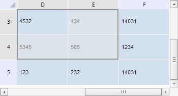

# TabSheet.getActiveSelectedRange

TabSheet.getActiveSelectedRange
-

**

# TabSheet.getActiveSelectedRange

## Синтаксис

getActiveSelectedRange();

## Описание

Метод getActiveSelectedRange** возвращает активный выделенный диапазон ячеек.

## Комментарии

Метод возвращает значение типа PP.Ui.[TabSheetRange](../TabSheetRange/TabSheetRange.htm).

## Пример

Для выполнения примера необходимо наличие на html-странице компонента [TabSheet](../../../Components/TabSheet/TabSheet/TabSheet.htm) с наименованием «tabSheet» (см. «[Пример создания компонента TabSheet](../../../Components/TabSheet/TabSheet/TabSheet_Example.htm)»). Выделим диапазон (3, 3, 4, 4) и отобразим его в видимой области таблицы:

// Получим диапазон ячеек по заданным координатам
var range = tabSheet.getRange(3, 3, 4, 4);
// Выделим диапазон
range.select();
// Получим активный выделенный диапазон ячеек
var activeRange = tabSheet.getActiveSelectedRange();
// Получим координаты правой нижней ячейки активного диапазона
var brCoord = activeRange.getCorners().brCoord;
// Отобразим диапазон в видимой области таблицы
if (tabSheet.isColVisibleAndOutsideVisibleRange(brCoord.colIndex) |
    tabSheet.isRowVisibleAndOutsideVisibleRange(brCoord.rowIndex)) {
    tabSheet.ensureRangeVisibility(activeRange)
};

В результате выполнения примера указанный диапазон был выбран и отображён в видимой области таблицы:

См. также:

[TabSheet](TabSheet.htm)

		Справочная
		 система на версию 10.9
		 от 18/08/2025,
		 © ООО «ФОРСАЙТ»,
