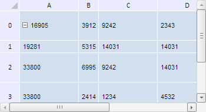

# TabSheet.getAdjustmentMgr

TabSheet.getAdjustmentMgr
-

**

# TabSheet.getAdjustmentMgr

## Синтаксис

getAdjustmentMgr();

## Описание

Метод getAdjustmentMgr** возвращает менеджер изменений размеров строк и столбцов таблицы.

## Комментарии

Метод возвращает объект типа PP.Ui.[TabSheetAdjustmentMgr](../TabSheetAdjustmentMgr/TabSheetAdjustmentMgr.htm).

## Пример

Для выполнения примера необходимо наличие на html-странице компонента [TabSheet](../../../Components/TabSheet/TabSheet/TabSheet.htm) с наименованием «tabSheet» (см. «[Пример создания компонента TabSheet](../../../Components/TabSheet/TabSheet/TabSheet_Example.htm)»). Установим автоматически ширину столбца и высоту строки с индексом 1:

// Получим менеджер изменений размеров строк и столбцов таблицы
var mgr = tabSheet.getAdjustmentMgr();
// Выполним автоподгонку ширины столбца с индексом 1
mgr.autoAdjustColumnWidth(1);
// Выполним автоподгонку высоты строки с индексом 1
mgr.autoAdjustRowHeight(1);

В результате выполнения примера была автоматически установлена ширина второго столбца и высота второй строки:

См. также:

[TabSheet](TabSheet.htm)

		Справочная
		 система на версию 10.9
		 от 18/08/2025,
		 © ООО «ФОРСАЙТ»,
