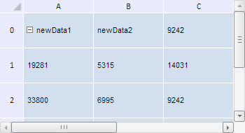

# TabSheet.getChangedData

TabSheet.getChangedData
-

**

# TabSheet.getChangedData

## Синтаксис

getChangedData();

## Описание

Метод getChangedData** возвращает массив изменённых данных.

## Комментарии

Метод возвращает массив объектов типа PP.Ui.[TabSheetCellChange](../TabSheetCellChange/TabSheetCellChange.htm).

## Пример

Для выполнения примера необходимо наличие на html-странице компонента [TabSheet](../../../Components/TabSheet/TabSheet/TabSheet.htm) с наименованием «tabSheet» (см. «[Пример создания компонента TabSheet](../../../Components/TabSheet/TabSheet/TabSheet_Example.htm)»). Изменим значения двух ячеек, затем отменим последнее действие и, наконец, полностью очистим массив команд отмены. При этом выведем в консоль браузера старое и новое значения изменённых ячеек, а также размер данного массива до и после отмены последнего изменения, а также до и после его очистки:

// Объявим функцию отображения данных измененных ячеек
var showChangedCellsData = function () {
    for (var i in changedData) {
        var value = changedData[i].getOldValue();
        var coord = value.getCoord();
        console.log("Старое значение ячейки (" + coord.rowIndex + ", " + coord.colIndex + "): " + value.CellData.FormattedText);
        value = changedData[i].getNewValue();
        coord = value.getCoord();
        console.log("Старое значение ячейки (" + coord.rowIndex + ", " + coord.colIndex + "): " + value.CellData.FormattedText);
    }
}
// Выведем длину массива команд отмены
console.log("Длина массива команд отмены: " + tabSheet.getChangedData().length);
// Изменим значения определенных ячеек
tabSheet.setCellValue("newData1", 0, 0);
tabSheet.setCellValue("newData2", 0, 1);
console.log("Длина массива команд отмены: " + tabSheet.getChangedData().length);
// Получим массив измененных ячеек
var changedData = tabSheet.getChangedData();
// Выведем информацию об измененных ячейках
showChangedCellsData();
// Удалим последнее изменение
tabSheet.removeUndo(1);
console.log("Длина массива команд отмены после удаления последнего изменения: " + tabSheet.getChangedData().length);
// Выведем информацию об измененных ячейках
showChangedCellsData();
// Очистим массив команд отмены
tabSheet.clearUndo();
console.log("Длина массива команд отмены после их очистки: " + tabSheet.getChangedData().length);

В результате выполнения примера была отменена последняя операция по изменению значений ячеек, после чего массив команд для отмены был полностью очищен.

При этом в консоль браузера были выведены старое и новое значения изменённых ячеек, а также размер массива команд для отмены до и после отмены последнего изменения, а также до и после его очистки:

Длина массива команд отмены: 2

Старое значение ячейки (0, 0): 16905

Старое значение ячейки (0, 0): newData1

Старое значение ячейки (0, 1): 3912

Старое значение ячейки (0, 1): newData2

Длина массива команд отмены после удаления последнего изменения: 1

Старое значение ячейки (0, 0): 16905

Старое значение ячейки (0, 0): newData1

Длина массива команд отмены после их очистки: 0

Таблица после выполнения примера будет выглядеть следующим образом:

См. также:

[TabSheet](TabSheet.htm)

		Справочная
		 система на версию 10.9
		 от 18/08/2025,
		 © ООО «ФОРСАЙТ»,
