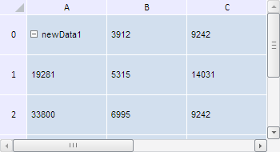

# TabSheet.getRedoChangedData

TabSheet.getRedoChangedData
-

**

# TabSheet.getRedoChangedData

## Синтаксис

getRedoChangedData();

## Описание

Метод getRedoChangedData** возвращает массив команд для их возврата.

## Комментарии

Метод возвращает массив объектов типа PP.Ui.[TabSheetCellChange](../TabSheetCellChange/TabSheetCellChange.htm).

## Пример

Для выполнения примера необходимо наличие на html-странице компонента [TabSheet](../../../Components/TabSheet/TabSheet/TabSheet.htm) с наименованием «tabSheet» (см. «[Пример создания компонента TabSheet](../../../Components/TabSheet/TabSheet/TabSheet_Example.htm)»). Изменим значения двух ячеек, затем отменим эти действия и, наконец, полностью очистим массив команд. При этом выведем в консоль браузера старое и новое значения изменённых ячеек, а также размер данного массива до и после его очистки:

console.log("Длина массива команд для возврата: " + tabSheet.getRedoChangedData().length);
// Изменим значения определенных ячеек
tabSheet.setCellValue("newData1", 0, 0);
tabSheet.setCellValue("newData2", 0, 1);
// Отменим последние изменения
tabSheet.undo();
tabSheet.undo();
// Получим массив команд для возврата
var redoChangedData = tabSheet.getRedoChangedData();
// Отобразим значения элементов массива команд для возврата
for (var i in redoChangedData) {
    var oldValue = redoChangedData[i].getOldValue();
    var newValue = redoChangedData[i].getNewValue();
    console.log("Старое значение ячейки (" + oldValue.getCoord().rowIndex + ", " + oldValue.getCoord().colIndex + "): " + oldValue.CellData.FormattedText);
    console.log("Новое значение ячейки (" + newValue.getCoord().rowIndex + ", " + newValue.getCoord().colIndex + "): " + newValue.CellData.FormattedText);
}
// Вернем последнее изменение
tabSheet.redo();
console.log("Длина массива команд после отмены изменения: " + tabSheet.getRedoChangedData().length);
// Очистим массив команд для возврата
tabSheet.clearRedo();
console.log("Длина массива команд для возврата после его очистки: " + tabSheet.getRedoChangedData().length);

В результате выполнения примера были отменены две операции по изменению значений ячеек, после чего массив команд для возврата был полностью очищен.

При этом в консоль браузера были выведены старое и новое значения изменённых ячеек, а также размер массива команд для возврата до и после его очистки:

Длина массива команд для возврата: 0

Старое значение ячейки (0, 1): 3912

Новое значение ячейки (0, 1): newData2

Старое значение ячейки (0, 0): 16905

Новое значение ячейки (0, 0): newData1

Длина массива команд после отмены изменения: 1

Длина массива команд для возврата после его очистки: 0

Таблица после выполнения примера будет выглядеть следующим образом:

См. также:

[TabSheet](TabSheet.htm)

		Справочная
		 система на версию 10.9
		 от 18/08/2025,
		 © ООО «ФОРСАЙТ»,
