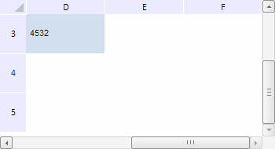

# TabSheet.hasRangesToLoad

TabSheet.hasRangesToLoad
-

**

# TabSheet.hasRangesToLoad

## Синтаксис

hasRangesToLoad();

## Описание

Метод hasRangesToLoad** определяет, есть ли видимые диапазоны, данные для которых необходимо загрузить из источника.

## Комментарии

Метод возвращает значение true, если существуют видимые диапазоны, данные для которых необходимо загрузить из источника, иначе - false.

## Пример

Для выполнения примера необходимо наличие на html-странице компонента [TabSheet](../../../Components/TabSheet/TabSheet/TabSheet.htm) с наименованием «tabSheet» (см. «[Пример создания компонента TabSheet](../../../Components/TabSheet/TabSheet/TabSheet_Example.htm)»). Прокрутим таблицу на максимальное количество строк и столбцов таблицы, загружая при необходимости данные из источника:

var maxRows = tabSheet.getMeasures().getMaxRow();
var maxColumns = tabSheet.getMeasures().getMaxColumn();
var iterationsCount = maxColumns > maxRows ? maxColumns : maxRows;
for (var i = 0; i < iterationsCount; i++) {
    if (i < maxRows) {
        // Прокручиваем таблицу на одну строку
        tabSheet.scrollToRow(i)
    };
    if (i < maxColumns) {
        // Прокручиваем таблицу на один столбец
        tabSheet.scrollToColumn(i)
    };
    // Определим, есть ли видимые диапазоны, данные для которых необходимо загрузить из источника
    if (tabSheet.hasRangesToLoad()) {
        // Вызываем событие загрузки данных из источника
        tabSheet.MetaChanged.fire(sender, PP.Ui.TabSheetMetaChangeType.Measures);
        // Загрузим видимые диапазоны таблицы
        tabSheet.loadVisibleRanges()
    }
};

В результате выполнения примера таблица была прокручена на максимальное количество строк и столбцов:

См. также:

[TabSheet](TabSheet.htm)

		Справочная
		 система на версию 10.9
		 от 18/08/2025,
		 © ООО «ФОРСАЙТ»,
