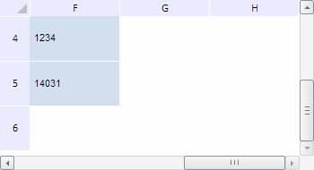

# TabSheet.insertColumn

TabSheet.insertColumn
-

**

# TabSheet.insertColumn

## Синтаксис

insertColumn(afterColIndex: Number, size: Number | String, count: Number, fireEvent: Boolean, callback: PP.Delegate);

## Параметры

*afterColIndex.* Столбец, после которого будет осуществлена вставка;

*size.* Размер вставляемых столбцов;

*count.* Количество столбцов для вставки;

f*ireEvent.* *Определяет, генерировать ли событие вставки столбцов таблицы*. Если параметр равен значению true, то данное событие будет сгенерировано, иначе - не будет;

*callback.* Возвратная функция.

## Описание

Метод insertColumn** вставляет столбцы в таблицу.

## Пример

Для выполнения примера необходимо наличие на html-странице компонента [TabSheet](../../../Components/TabSheet/TabSheet/TabSheet.htm) с наименованием «tabSheet» (см. «[Пример создания компонента TabSheet](../../../Components/TabSheet/TabSheet/TabSheet_Example.htm)»). Вставим два столбца и одну строку в конец таблицы:

// Отключим перерисовку таблицы
tabSheet.rerenderDisable();
// Получим индекс последнего столбца
var lastColIndex = tabSheet.getMeasures().getLastColIndex();
// Вставляем новую колонку в конец таблицы
tabSheet.insertColumn(lastColIndex, "auto", 2);
// Прокручиваем таблицу к этому столбцу
if (!tabSheet.isColInsideVisibleRange(lastColIndex + 2)) {
    tabSheet.scrollToColumn(lastColIndex + 2)
};
// Получим индекс последней строки
var lastRowIndex = tabSheet.getMeasures().getLastRowIndex();
// Вставляем новую строку в конец таблицы
tabSheet.insertRow(lastRowIndex, "auto", 1);
// Прокручиваем таблицу к этой строке
if (!tabSheet.isRowInsideVisibleRange(lastRowIndex + 1)) {
    tabSheet.scrollToRow(lastRowIndex + 1)
};
// Включим перерисовку таблицы
tabSheet.rerenderEnable();

В результате выполнения примера в таблицу были вставлены два столбца и одна строка:

См. также:

[TabSheet](TabSheet.htm)

		Справочная
		 система на версию 10.9
		 от 18/08/2025,
		 © ООО «ФОРСАЙТ»,
