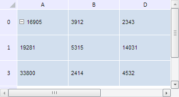

# TabSheet.isLastVisibleColumn

TabSheet.isLastVisibleColumn
-

**

# TabSheet.isLastVisibleColumn

## Синтаксис

isLastVisibleColumn(colIndex: Number);

## Параметры

*colIndex.* Индекс столбца
 таблицы.

## Описание

Метод isLastVisibleColumn**
 определяет, является ли указанный столбец последним видимым.

## Комментарии

Метод возвращает значение true,
 если указанный столбец является последним из всех видимых столбцов таблицы,
 иначе - значение false.

## Пример

Для выполнения примера необходимо наличие на html-странице компонента
 [TabSheet](../../../Components/TabSheet/TabSheet/TabSheet.htm)
 с наименованием «tabSheet» (см. «[Пример
 создания компонента TabSheet](../../../Components/TabSheet/TabSheet/TabSheet_Example.htm)»). Скроем в таблице строку и столбец
 с индексом 2. Определим, входят ли в видимый диапазон столбцы E и F, строки
 с индексами 4 и 5. Также проверим, является ли последние строка и столбец
 видимого диапазона последними нескрытыми в таблице:

// Скроем третью строку и столбец
tabSheet.hideRows(2, 1);
tabSheet.hideColumns(2,1);
// Обновим таблицу
tabSheet.rerender();
// Получим информацию о строках и столбцах таблицы
console.log("Столбец E в видимый диапазон " + (tabSheet.isColInsideVisibleRange(5) ? "входит." : "не входит."));
console.log("Столбец F в видимый диапазон " + (tabSheet.isColInsideVisibleRange(6) ? "входит." : "не входит."));
var isLastVisibleColumn = tabSheet.isLastVisibleColumn(5) ? "является" : "не является";
console.log("Последний столбец видимого диапазона " + isLastVisibleColumn + " последним нескрытым в таблице.");
console.log("Строка с индексом 4 в видимый диапазон " + (tabSheet.isRowInsideVisibleRange(4) ? "входит." : "не входит."));
console.log("Строка с индексом 5 в видимый диапазон " + (tabSheet.isRowInsideVisibleRange(5) ? "входит." : "не входит."));
var isLastVisibleRow = tabSheet.isLastVisibleRow(5) ? "является" : "не является";
console.log("Последняя строка видимого диапазона " + isLastVisibleRow + " последней нескрытой в таблице.");
После выполнения примера скроются строка и столбец с индексами 2:

В консоли браузера будут выведены сведения о том, входят ли в видимый
 диапазон столбцы E и F, строки с индексами 4 и 5, а также информация о
 том, является ли последние строка и столбец видимого диапазона последними
 нескрытыми в таблице:

Столбец E в видимый диапазон входит.

Столбец F в видимый диапазон не входит.

Последний столбец видимого диапазона является последним
 нескрытым в таблице.

Строка с индексом 4 в видимый диапазон входит.

Строка с индексом 5 в видимый диапазон не входит.

Последняя строка видимого диапазона является последней
 нескрытой в таблице.

См. также:

[TabSheet](TabSheet.htm)

		Справочная
		 система на версию 10.9
		 от 18/08/2025,
		 © ООО «ФОРСАЙТ»,
