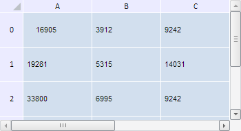

# TabSheet.removeExpander

TabSheet.removeExpander
-

**

# TabSheet.removeExpander

## Синтаксис

removeExpander(coord: PP.Ui.[TabSheetCoord](../TabSheetCoord/TabSheetCoord.htm), noCacheRemove);

## Параметры

*coord.* Координата ячейки, в которой необходимо удалить кнопку развёртывания.

*noCacheRemove.* Признак удаления кнопки развёртывания из закешированной ячейки. Если параметр равен true, то удаление будет произведено из реальной ячейки,

## Описание

Метод removeExpander** удаляет кнопку развёртывания из ячейки с указанной координатой.

## Пример

Для выполнения примера необходимо наличие на html-странице компонента [TabSheet](../../../Components/TabSheet/TabSheet/TabSheet.htm) с наименованием «tabSheet» (см. «[Пример создания компонента TabSheet](../../../Components/TabSheet/TabSheet/TabSheet_Example.htm)»). Удалим кнопку развёртывания из ячейки с координатой (0, 0):

// Определим координаты верхней левой ячейки таблицы
var coord = tabSheet.coord(0 ,0);
// Получим экспандер по координатам
if (tabSheet.getExpanderUnderCoord(coord)) {
    // Удалим кнопку развёртывания
    tabSheet.removeExpander(coord)
};

В результате выполнения примера из ячейки с координатой (0, 0) была удалена кнопка развёртывания:

См. также:

[TabSheet](TabSheet.htm)

		Справочная
		 система на версию 10.9
		 от 18/08/2025,
		 © ООО «ФОРСАЙТ»,
