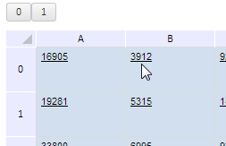

# TabSheet.removeFilter

TabSheet.removeFilter
-

**

# TabSheet.removeFilter

## Синтаксис

removeFilter(colIndex: Number);

## Параметры

*colIndex.* Индекс столбца
 таблицы.

## Описание

Метод removeFilter** убирает
 фильтр со столбца таблицы.

## Комментарии

Метод используется для таблиц с установленным фильтром по столбцу. Установка
 фильтра на столбец выполняется с помощью метода [addFilter](TabSheet.addFilter.htm).

## Пример

Для выполнения примера необходимо наличие на html-странице компонента
 [TabSheet](../../../Components/TabSheet/TabSheet/TabSheet.htm)
 с наименованием «tabSheet» (см. «[Пример
 создания компонента TabSheet](../../../Components/TabSheet/TabSheet/TabSheet_Example.htm)») с фильтром для второго столбца таблицы.

// Снимем фильтр со столбца таблицы
tabSheet.removeFilter(1)
// Обработаем событие CoordUnderMouseChanged
tabSheet.CoordUnderMouseChanged.add(function (sender, args) {
    button1.setContent(args.newCoord.rowIndex);
    button2.setContent(args.newCoord.colIndex);
});
После выполнения примера фильтр с таблицы будет снят, и при перемещении
 указателя мыши над ячейками таблицы в тексте кнопок отобразятся координаты
 ячеек:

См. также:

[TabSheet](TabSheet.htm)

		Справочная
		 система на версию 10.9
		 от 18/08/2025,
		 © ООО «ФОРСАЙТ»,
