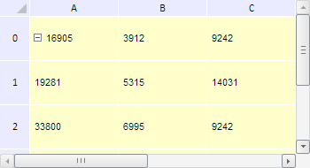

# TabSheet.resetCoord

TabSheet.resetCoord
-

**

# TabSheet.resetCoord

## Синтаксис

resetCoord(coord: PP.Ui.[TabSheetCoord](../TabSheetCoord/TabSheetCoord.htm), isMassReset);

## Параметры

*coord.* Ячейка таблицы, которую нужно перерисовать.

*isMassReset.* Признак перерисовки всех ячеек таблицы. Если параметр равен значению true, то перерисована будет только указанная ячейка , иначе - все ячейки таблицы.

## Описание

Метод resetCoord** перерисовывает ячейку таблицы.

## Пример

Для выполнения примера необходимо наличие на html-странице компонента [TabSheet](../../../Components/TabSheet/TabSheet/TabSheet.htm) с наименованием «tabSheet» (см. «[Пример создания компонента TabSheet](../../../Components/TabSheet/TabSheet/TabSheet_Example.htm)»). Установим жёлтый цвет для заливки ячеек таблицы и перерисуем их для применения изменений:

// Обработаем событие StyleChanged
tabSheet.StyleChanged.add(function (sender, args) {
    console.log("Новый цвет заливки: " + args.newValue.Fill.Color)
});
var coord = tabSheet.coord(1, 1);
var range = tabSheet.getRange(0, 0, 5, 5);
var model = tabSheet.getModel();
// Установим новое значение для данной ячейки
var style = tabSheet.getModel().getStyle(range);
style.Fill.C = "#FFFFCC";
model.setStyle(range, style);
// Перерисуем все ячейки таблицы
tabSheet.resetCoord(coord, false);

В результате выполнения примера был установлен жёлтый цвет для заливки ячеек таблицы, которые затем были перерисованы:

А в консоли браузера при обработке события изменения стиля таблицы StyleChanged был выведен код цвета заливки:

Новый цвет заливки: #FFFFCC

См. также:

[TabSheet](TabSheet.htm)

		Справочная
		 система на версию 10.9
		 от 18/08/2025,
		 © ООО «ФОРСАЙТ»,
