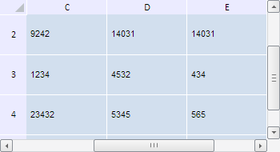

# TabSheet.scrollHorizontal

TabSheet.scrollHorizontal
-

**

# TabSheet.scrollHorizontal

## Синтаксис

scrollHorizontal(posInPx: Number);

## Параметры

*posInPx.* Количество виртуальных пикселей, на которое нужно осуществить прокрутку.

## Описание

Метод scrollHorizontal** осуществляет горизонтальную прокрутку таблицы.

## Пример

Для выполнения примера необходимо наличие на html-странице компонента [TabSheet](../../../Components/TabSheet/TabSheet/TabSheet.htm) с наименованием «tabSheet» (см. «[Пример создания компонента TabSheet](../../../Components/TabSheet/TabSheet/TabSheet_Example.htm)»). Выполним горизонтальную прокрутку таблицы на 300 пикселей и вертикальную на 150 пикселей:

// Выполним горизонтальную прокрутку таблицы
tabSheet.scrollHorizontal(300);
// Выполним вертикальную прокрутку таблицы
tabSheet.scrollVertical(150);

В результате выполнения примера была выполнена горизонтальная прокрутка таблицы на 300 пикселей и вертикальная на 150 пикселей:

См. также:

[TabSheet](TabSheet.htm)

		Справочная
		 система на версию 10.9
		 от 18/08/2025,
		 © ООО «ФОРСАЙТ»,
