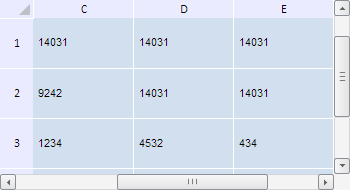

# TabSheet.scrollToColumnAsToLast

TabSheet.scrollToColumnAsToLast
-

**

# TabSheet.scrollToColumnAsToLast

## Синтаксис

scrollToColumnAsToLast(colIndex: Number);

## Параметры

*colIndex.* Индекс столбца, к которому нужно прокрутить таблицу.

## Описание

Метод scrollToColumnAsToLast** выполняет прокрутку таблицы к указанному столбцу, чтобы он был последним видимым.

## Пример

Для выполнения примера необходимо наличие на html-странице компонента [TabSheet](../../../Components/TabSheet/TabSheet/TabSheet.htm) с наименованием «tabSheet» (см. «[Пример создания компонента TabSheet](../../../Components/TabSheet/TabSheet/TabSheet_Example.htm)»). Выполним прокрутку таблицы к столбцу с индексом 4 и к строке с индексом 3 так, чтобы они были последними видимыми в таблице:

// Выполним прокрутку к столбцу с индексом 4, чтобы она была последней видимой
tabSheet.scrollToColumnAsToLast(4);
// Выполним прокрутку к строке c индексом 3, чтобы она была последней видимой
tabSheet.scrollToRowAsToLast(3);

В результате выполнения примера была выполнена прокрутка таблицы к столбцу с индексом 4 и к строке с индексом 3 так, чтобы они были последними видимыми в таблице:

См. также:

[TabSheet](TabSheet.htm)

		Справочная
		 система на версию 10.9
		 от 18/08/2025,
		 © ООО «ФОРСАЙТ»,
