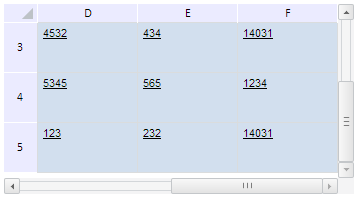

# TabSheet.scrollToPos

TabSheet.scrollToPos
-

# TabSheet.scrollToPos

## Синтаксис

scrollToPos (rowIndex, colIndex, fireEvent);

## Параметры

rowIndex. Индекс строки, к которой необходимо осуществить прокрутку;

colIndex. Индекс столбца, к которому нужно осуществить прокрутку

fireEvent. Определяет, будет ли при выполнении метода генерироваться событие ScrollChanged.

## Описание

Метод scrollToPos осуществляет прокрутку таблицы до указанных строки и столбца.

## Пример

Для выполнения примера необходимо наличие на html-странице компонента [TabSheet](../../../Components/TabSheet/TabSheet/TabSheet.htm) с наименованием «tabSheet» (см. «[Пример создания компонента TabSheet](../../../Components/TabSheet/TabSheet/TabSheet_Example.htm)»). Осуществим прокрутку содержимого таблицы к строке и столбцу с индексом 5:

tabSheet.ScrollChanged.add(function (sender, args) {
   console.log("Row: " + args.RowIndex + "; Column " + args.ColIndex)
});
tabSheet.scrollToPos(5, 5, true);

После выполнения примера будет осуществлена прокрутка таблицы к строке и столбцу с индексом 5:

Будет сгенерировано событие [TabSheet.ScrollChanged](TabSheet.ScrollChanged.htm): в консоль браузера будут выведены индексы первого видимого столбца и строки:

Row: 3; Column 3

См. также:

[TabSheet](TabSheet.htm)

		Справочная
		 система на версию 10.9
		 от 18/08/2025,
		 © ООО «ФОРСАЙТ»,
