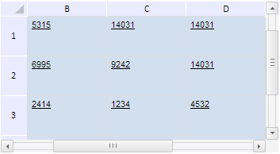

# TabSheet.scrollToPosInPx

TabSheet.scrollToPosInPx
-

# TabSheet.scrollToPosInPx

## Синтаксис

scrollToPosInPx (verPosInPx, horPosInPx, fireEvent);

## Параметры

verPosInPx. Количество виртуальных пискселей, к которому нужно осуществить прокрутку по вертикали;

horPosInPx. Количество виртуальных пискселей, к которому нужно осуществить прокрутку по горизонтали;

fireEvent. Определяет, будет ли при выполнении метода генерироваться событие ScrollChanged.

## Описание

Метод scrollToPosInPx осуществляет прокрутку таблицы на определенное количество пикселей по вертикали и горизонтали.

## Пример

Для выполнения примера необходимо наличие на html-странице компонента [TabSheet](../../../Components/TabSheet/TabSheet/TabSheet.htm) с наименованием «tabSheet» (см. «[Пример создания компонента TabSheet](../../../Components/TabSheet/TabSheet/TabSheet_Example.htm)»). Осуществим прокрутку содержимого таблицы на 100 виртуальных пикселей по вертикали и на 200 пикселей по горизонтали:

tabSheet.ScrollChanged.add(function (sender, args) {
    console.log("X: " + args.HScrollPos + "; Y" + args.VScrollPos)
});
tabSheet.scrollToPosInPx(100, 200, true);

После выполнения примера будет осуществлена прокрутка таблицы на 100 пикселей по вертикали и на 200 по горизонтали:

Будет сгенерировано событие [TabSheet.ScrollChanged](TabSheet.ScrollChanged.htm): в консоль браузера будут выведены позиции ползунка полосы прокрутки по горизонтали и вертикали:

X: 33; Y33

См. также:

[TabSheet](TabSheet.htm)

		Справочная
		 система на версию 10.9
		 от 18/08/2025,
		 © ООО «ФОРСАЙТ»,
