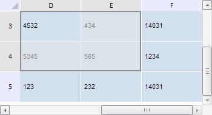

# TabSheet.scrollToRange

TabSheet.scrollToRange
-

**

# TabSheet.scrollToRange

## Синтаксис

scrollToRange(range: PP.Ui.[TabSheetRange](../TabSheetRange/TabSheetRange.htm));

## Параметры

*range.* Диапазон, к которому необходимо прокрутить таблицу.

## Описание

Метод scrollToRange** выполняет прокрутку таблицы к указанному диапазону.

## Пример

Для выполнения примера необходимо наличие на html-странице компонента [TabSheet](../../../Components/TabSheet/TabSheet/TabSheet.htm) с наименованием «tabSheet» (см. «[Пример создания компонента TabSheet](../../../Components/TabSheet/TabSheet/TabSheet_Example.htm)»). Прокрутим таблицу к диапазону с координатами (3, 3) - (4, 4):

// Получим диапазон ячеек по заданным координатам
var range = tabSheet.getRange(3, 3, 4, 4)
// Выполним прокрутку к заданному диапазону
tabSheet.scrollToRange(range);
// Выделим диапазон
range.select();
// Сделаем данный диапазон доступным
tabSheet.setRangeEnabled(range, true);

В результате выполнения примера была выполнена прокрутка таблицы к диапазону с координатами (3, 3) - (4, 4), а сам диапазон был выделен:

См. также:

[TabSheet](TabSheet.htm)

		Справочная
		 система на версию 10.9
		 от 18/08/2025,
		 © ООО «ФОРСАЙТ»,
