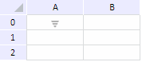
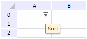

# TabSheet.setCellPictureSettings

TabSheet.setCellPictureSettings
-

# TabSheet.setCellPictureSettings

## Синтаксис

setCellPictureSettings(row, col, settings);

## Параметры

row. Number.
 Индекс строки ячейки;

col. Number.
 Индекс столбца ячейки;

settings. JSON-объект
 с настройками изображения. Объект содержит следующие поля:

		 Название параметра
		 Тип
		 Краткое описание

		 @H
		 Integer
		 Индекс изображения, которое будет отображаться в ячейке при
		 наведении курсора.

		 @N
		 Integer
		 Индекс изображения, которое будет отображаться в ячейке.

Список изображений задается в JSON-настройках
		 источника данных таблицы с помощью объекта [Images](../../../Components/TabSheet/TabSheet/TabSheet_JSON.htm#images).

		 @T
		 String
		 Текст всплывающей подсказки для изображения.

		 @HA
		 Integer
		 Тип выравнивания по горизонтали:

			- 0. По левому
			 краю;

			- 1. По центру;

			- 2. По правому краю.

		 @VA
		 Integer
		 Тип выравнивания по вертикали:

			- 0. По верхнему
			 краю;

			- 1. По нижнему
			 краю;

			- 2. По центру.

## Описание

Метод setCellPictureSettings
 устанавливает настройки для изображения в ячейке таблицы.

## Комментарии

Для работы метода необходимо, чтобы в JSON-настройках источника данных
 таблицы был задан список изображений, закодированных в base64. Пример
 JSON-настроек источника данных таблицы приведен в файле [tabSheetJSON.js](TabSheet.setCellPictureSettings.htm#file).

Для получения подробной информации о JSON-объекте компонента [TabSheet](../../../Components/TabSheet/TabSheet/TabSheet.htm)
 обратитесь к разделу «[JSON
 объект компонента TabSheet](../../../Components/TabSheet/TabSheet/TabSheet_JSON.htm)».

## Пример

Для выполнения примера предполагается наличие файла tabSheetJSON.js
 с настройками источника данных таблицы.

[Содержимое
 файла tabSheetJSON.js](javascript:TextPopup(this))

data = {
   "Structure": {
      "@MUR": 2,
      "@MUC": 1,
      "DefaultRow": {
         "@H": 19
      },
      "DefaultColumn": {
         "@W": 71
      }
   },
   "Cells": {
      //Настройки ячейки с координатами (0,0)
      "Cell": [{
            "@L": 0,
            "@T": 0,
            "@SI": 1,
            "CellData": {
               "@IE": false,
               "@FT": "",
               "@V": "1"
            },
            //Данные об изображении в таблице
            "PD": {
               //Текст всплывающей подсказки
               "@T": "",
               //Активность
               "@E": true,
               //Выравнивание по вертикали
               "@VA": 1,
               //Индекс изображения при наведении курсора
               "@H": 0,
               //Выравнивание по горизонтали
               "@HA": 2,
               //Индекс изображения в нормальном состоянии
               "@N": 0
            }
         }
      ]
   },
   "Styles": {
      "Style": [{
         "Text": {}
      }]
   },
   //Набор изображений для таблицы
   "Images": {
      "TabImages": {
         "TabImage": [{
            "@CT": "png",
            "@W": 22,
            "@H": 13,
            //Индекс изображения
            "@I": 0,
            "$": "iVBORw0KGgoAAAANSUhEUgAAABYAAAANCAYAAACtpZ5jAAAAAXNSR0IArs4c6QAAAARnQU1BAACxjwv8YQUAAAAJcEhZcwAADsAAAA7AAWrWiQkAAAAfdEVYdFNvZnR3YXJlAFBhaW50Lk5FVCA\/Pz8\/Pz8gMy41LjHgp8d4AAAAW0lEQVQ4T2MYPiAjIyM8LS2tAR8GqYEqJx4ANclgMwwZg9RAlQ8SAHSRCjaXgjBIDqqMPIDNUBCGSg9SAPR2EMylIDZUmHIANEwOyWA5qDB1AMhAqhs6iAADAwDtZUcr5mtBbwAAAABJRU5ErkJggg=="
         }, {
            "@CT": "png",
            "@W": 22,
            "@H": 13,
            "@I": 1,
            "$": "iVBORw0KGgoAAAANSUhEUgAAABYAAAANCAYAAACtpZ5jAAAAAXNSR0IArs4c6QAAAARnQU1BAACxjwv8YQUAAAAJcEhZcwAADsAAAA7AAWrWiQkAAAAfdEVYdFNvZnR3YXJlAFBhaW50Lk5FVCA\/Pz8\/Pz8gMy41LjHgp8d4AAAAW0lEQVQ4T2MYPiAjI2NtWlraf3wYpAaqnHgA1GSOzTBkDFIDVT5IANBF7thcCsIgOagy8gA2Q0EYKj1IAdDbS2AuBbGhwpQDoGHWSAZbQ4WpA0AGUt3QQQQYGAADGFlLIcmooQAAAABJRU5ErkJggg=="
         }, ]
      }
   }
}

Перед выполнением примера ознакомьтесь с [рекомендациями](dhtml.chm::/specification/JavaScript_main.htm)
 к написанию кода.

Для добавления таблицы, в которой настроено изображение для ячейки с
 координатами (0,0), используйте HTML-код:

<!DOCTYPE html PUBLIC "-//W3C//DTD XHTML 1.0 Transitional//EN" "http://www.w3.org/TR/xhtml1/DTD/xhtml1-transitional.dtd">
<html>
<head>
    <link href="../build/PP.css" type="text/css" rel="stylesheet" />
    
    
    

    
</head>
<body onload="tbsht()" id="root">
</body>
</html>

В результате выполнения примера на странице будет размещена таблица
 с изображением в ячейке с координатами (0,0):

При наведении курсора на изображение её внешний вид не изменяется и
 не вызывается всплывающая подсказка.

Установим изображение, которое будет отображаться при наведении курсора,
 настроим всплывающую подсказку и изменим выравнивание одним из способов:

	- добавим часть кода после определения переменной component в
	 используемом HTML-коде:

component.RangesLoaded.add(()=> {
    component.setCellPictureSettings(0, 0, {"@H": 1, "@N": 0, "@T": "Sort", "@HA": 1, "@VA":2});
});

	- выполним в консоли браузера:

component.setCellPictureSettings(0, 0, {"@H": 1, "@N": 0, "@T": "Sort", "@HA": 1, "@VA":2});

После выполнения метода setCellPictureSettings
 для изображения будет установлено выравнивание по горизонтали по правому
 краю и по вертикали по центру. При наведении курсора внешний вид изображения
 изменится (будет использовано изображение с индексом 1, описанное в JSON-настройках),
 и отобразится всплывающая подсказка:

См. также:

[TabSheet](TabSheet.htm)

		Справочная
		 система на версию 10.9
		 от 18/08/2025,
		 © ООО «ФОРСАЙТ»,
