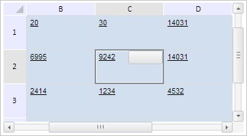

# TabSheet.setCellsValues

TabSheet.setCellsValues
-

# TabSheet.setCellsValues

## Синтаксис

setCellsValues(values: Array, fireEvent: Boolean);

## Параметры

values. Массив значений ячеек;

fireEvent. Признак вызова события.

## Описание

Метод setCellsValues устанавливает новые значения ячеек таблицы на основе указанного массива данных.

## Пример

Для выполнения примера необходимо наличие на html-странице компонента [TabSheet](../../../Components/TabSheet/TabSheet/TabSheet.htm) с наименованием «tabSheet» (см. «[Пример создания компонента TabSheet](../../../Components/TabSheet/TabSheet/TabSheet_Example.htm)»). Определим массив значений ячеек. Установим новые значения ячеек. Установим сохраненные индексы строки и столбца и на их основе восстановим позиции элементов прокрутки. Определим и установим элемент, отображающийся при выборе ячейки. Установим позицию этого элемента и выделим указанную ячейку:

// Определим массив значений ячеек
var cellsValues = [{
    Value: 20,
    rowIndex: 1,
    colIndex: 1
}, {
    Value: 30,
    rowIndex: 1,
    colIndex: 2
}];
// Установим массив значений ячеек
tabSheet.setCellsValues(cellsValues, true);
// Установим сохраненный индекс строки
tabSheet.setPreservedFvRow(1);
// Установим сохраненный индекс столбца
tabSheet.setPreservedFvCol(1);
// Восстановим сохраненные позиции прокруток
tabSheet._recoverPreservedScrollsPosition();
// Определим элемент, отображающийся при выборе ячейки
var btn = new PP.Ui.Button({
    Width: 50,
    Height: 20
});
var selectionControl = {
    Control: btn,
    Width: 50,
    Height: 50
}
// Установим элемент, отображающийся при выборе ячейки
tabSheet.setSelectionControl(selectionControl);
// Установим позицию элемента, отображающегося при выборе ячейки
tabSheet.setSelectionControlPosition(PP.Ui.TSSelControlPos.TopRight);
// Выделим ячейку C2
tabSheet.select(tabSheet.getRangeFromString("C2:C2"));

В результате выполнения примера был установлен новый массив значений, было изменено значение элементов прокруток, был установлен элемент, отображающийся при выборе ячейки, для которого была установлена новая позиция, была выделена указанная ячейка:

См. также:

[TabSheet](TabSheet.htm)

		Справочная
		 система на версию 10.9
		 от 18/08/2025,
		 © ООО «ФОРСАЙТ»,
