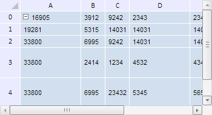

# TabSheet.setColumnsWidth

TabSheet.setColumnsWidth
-

**

# TabSheet.setColumnsWidth

## Синтаксис

setColumnsWidth(value: Number, colIndex: Number, count: Number, fireEvent: Boolean);

## Параметры

*value.* Устанавливаемое значение ширины;

*colIndex.* Индекс столбца, начиная с которого устанавливается новая ширина;

*count.* Количество столбцов;

*fireEvent.* Определяет, генерировать ли событие установки новой ширины для столбцов таблицы. Если параметр равен значению true, то данное событие будет сгенерировано, иначе - не будет.

## Описание

Метод setColumnsWidth** устанавливает ширину столбцов таблицы.

## Пример

Для выполнения примера необходимо наличие на html-странице компонента [TabSheet](../../../Components/TabSheet/TabSheet/TabSheet.htm) с наименованием «tabSheet» (см. «[Пример создания компонента TabSheet](../../../Components/TabSheet/TabSheet/TabSheet_Example.htm)»). Установим новую ширину для столбцов с индексами 1 и 2, а также новую высоту для строк с индексами 0, 1 и 3:

// Установим ширину для двух столбцов, начиная со столбца с индексом 1
tabSheet.setColumnsWidth(40, 1, 2);
// Установим высоту для трёх строк, начиная со строки с индексом 0
tabSheet.setRowsHeight(20, 0, 3);

В результате выполнения примера была установлена новая ширина для столбцов с индексами 1 и 2, а также новая высота для строк с индексами 0, 1 и 3

См. также:

[TabSheet](TabSheet.htm)

		Справочная
		 система на версию 10.9
		 от 18/08/2025,
		 © ООО «ФОРСАЙТ»,
