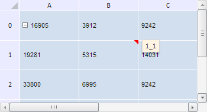

# TabSheet.setComment

TabSheet.setComment
-

**

# TabSheet.setComment

## Синтаксис

setComment(range: PP.Ui.[TabSheetRange](../TabSheetRange/TabSheetRange.htm), comment: String);

## Параметры

*range.* Диапазон ячеек таблицы, для которого устанавливается комментарий;

*comment.* Текст самого комментария.

## Описание

Метод setComment** устанавливает комментарий у диапазона ячеек таблицы.

## Пример

Для выполнения примера необходимо наличие на html-странице компонента [TabSheet](../../../Components/TabSheet/TabSheet/TabSheet.htm) с наименованием «tabSheet» (см. «[Пример создания компонента TabSheet](../../../Components/TabSheet/TabSheet/TabSheet_Example.htm)»). Зададим комментарий для ячейки с координатами (1, 1):

var coord = tabSheet.coord(1, 1);
// Получим диапазон ячеек по заданным координатам
var range = tabSheet.getCell(coord.rowIndex, coord.colIndex);
// Зададим комментарии к ячейкам у заданного диапазона
tabSheet.setComment(range, coord.toString());

В результате выполнения примера для ячейки был установлен комментарий со значением её координат - «1_1»:

См. также:

[TabSheet](TabSheet.htm)

		Справочная
		 система на версию 10.9
		 от 18/08/2025,
		 © ООО «ФОРСАЙТ»,
