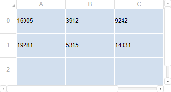

# TabSheet.setDynamicExpansion

TabSheet.setDynamicExpansion
-

# TabSheet.setDynamicExpansion

## Синтаксис

setDynamicExpansion(value: boolean);

## Параметры

*value.* Признак использования динамического увеличения количества
 строк/столбцов:

	- True. Количество строк/столбцов
	 таблицы автоматически увеличивается при достижении последней заполненной
	 ячейки;

	- False. Количество строк/столбцов
	 таблицы отображается до последней заполненной ячейки.

## Описание

Метод setDynamicExpansion устанавливает
 признак использования динамического увеличения количества строк/столбцов
 при достижении последней заполненной ячейки таблицы.

## Комментарии

Для установки признака динамического увеличения количества строк/столбцов
 в [конструкторе TabSheet](Constructor_TabSheet.htm) используйте
 свойство [DynamicExpansion](../../../Interfaces/TabSheetSettings/TabSheetSettings.DynamicExpansion.htm).

Для получения признака динамического увеличения количества строк/столбцов
 используйте метод [getDynamicExpansion](TabSheet.getDynamicExpansion.htm).

## Пример

Для выполнения примера используйте HTML-код:

<!DOCTYPE html PUBLIC "-//W3C//DTD XHTML 1.0 Transitional//EN" "http://www.w3.org/TR/xhtml1/DTD/xhtml1-transitional.dtd">
<html>
<head>
    <meta http-equiv="X-UA-Compatible" content="IE=edge" />
    <title>TabSheet</title>
    
    
    <link href="../build/PP.css" rel="stylesheet" type="text/css" />
</head>

<body onload="createTabSheet()">
    

</body>
</html>

В результате выполнения примера на html-странице будет размещена таблица
 с возможностью вертикальной и горизонтальной прокрутки для использования
 динамического увеличения количества строк/столбцов:

В консоль будет выведено сообщение об использовании динамического увеличения
 количества строк/столбцов при достижении последней заполненной ячейки.

См. также:

[TabSheet](TabSheet.htm)

		Справочная
		 система на версию 10.9
		 от 18/08/2025,
		 © ООО «ФОРСАЙТ»,
