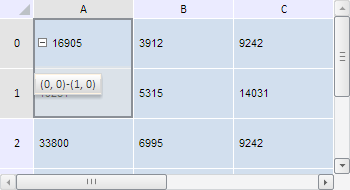

# TabSheet.setHint

TabSheet.setHint
-

**

# TabSheet.setHint

## Синтаксис

setHint(range: PP.Ui.[TabSheetRange](../TabSheetRange/TabSheetRange.htm),
 *hint: String*);

## Параметры

*range.* Диапазон ячеек
 таблицы, для которого устанавливается всплывающая подсказка;

*hint.* Текст всплывающей подсказки.

## Описание

Метод setHint** изменяет
 всплывающие подсказки у диапазона ячеек таблицы.

## Пример

Для выполнения примера необходимо наличие на html-странице компонента
 [TabSheet](../../../Components/TabSheet/TabSheet/TabSheet.htm)
 с наименованием «tabSheet» (см. «[Пример
 создания компонента TabSheet](../../../Components/TabSheet/TabSheet/TabSheet_Example.htm)»). Установим всплывающую подсказку для
 диапазона с координатами (0, 0)-(1,0) и обработаем событие HintChanged
 , выводя список ячеек в данном диапазоне:

// Обработаем событие HintChanged
tabSheet.HintChanged.add(function (sender, eventArgs) {
    // Получаем модель таблицы
    var model = tabSheet.getModel();
    // Получаем все ячейки таблицы
    var cells = model.getCells();
    console.log("Ячейки, входящие в диапазон:");
    var coord;
    for (var i in cells) {
        for (var j in cells[i]) {
            // Проверяем ячейки, у которых есть комментарий
            if (cells[i][j].getHint()) {
                coord = cells[i][j].getCoord()
                console.log("(" + coord.colIndex + ", " + coord.rowIndex + ") ");
            }
        }
    }
});
// Получим диапазон ячеек по заданным координатам
var range = tabSheet.getRange(0, 0, 0, 1);
// Выделим диапазон
range.select();
// Получим координаты диапазона
var tlCoord = range.getCorners().tlCoord;
var brCoord = range.getCorners().brCoord;
// Установка всплывающей подсказки к ячейкам у заданного диапозона
tabSheet.setHint(range, "(" + tlCoord.rowIndex + ", " + tlCoord.colIndex + ")-(" + brCoord.rowIndex + ", " + brCoord.colIndex + ")");

В результате выполнения примера для диапазона был установлен комментарий
 со значением его координат - «(0, 0)-(1,0)»:

В консоли браузера при обработке события HintChanged
 был выведен список координат в диапазоне, для которого была установлена
 всплывающая подсказка:

Ячейки, входящие в диапазон:

(0, 0)

(0, 1)

См. также:

[TabSheet](TabSheet.htm)

		Справочная
		 система на версию 10.9
		 от 18/08/2025,
		 © ООО «ФОРСАЙТ»,
