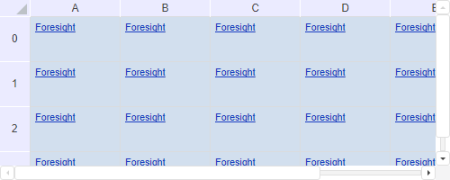

# TabSheet.showHyperlinksOnRange

TabSheet.showHyperlinksOnRange
-

# TabSheet.showHyperlinksOnRange

## Синтаксис

showHyperlinksOnRange (type, range);

## Параметры

type. Режим
 отображения содержимого ячеек таблицы в виде гиперссылок. Элемент перечисления
 [PP.Ui.TabSheetHyperLinkShowType](../../../Enums/TabSheetHyperLinkShowType.htm);

range. Массив
 диапазонов ячеек (диапазон ячеек), содержимое которых будет отображаться
 в виде гиперссылок.

## Описание

Метод showHyperlinksOnRange отображает
 содержимое ячеек таблицы в виде гиперссылок.

## Пример

Для выполнения примера необходимо наличие на html-странице компонента
 [TabSheet](../../../Components/TabSheet/TabSheet/TabSheet.htm)
 с наименованием «tabSheet» (см. «[Пример
 создания компонента TabSheet](../../../Components/TabSheet/TabSheet/TabSheet_Example.htm)»). Создадим гиперссылку, отобразим её
 в ячейках таблицы и обработаем событие нажатия на неё HyperlinkMouseDown:

// Получим ячейку B1
var cell = tabSheet.getCell(1, 1);
// Получим стиль ячейки
var style = cell.getStyle();
// Зададим цвет, доступность, стиль, текст, адрес гиперссылки
style.Hyperlink.Color = "#1A3DC1";
style.Hyperlink.Enable = true;
style.Hyperlink.Underline = true;
style.Hyperlink.Text = "Foresight";
style.Hyperlink.Action = "http://www.fsight.ru";
// Отобразим гиперссылки в диапазоне ячеек A0:F5
tabSheet.showHyperlinksOnRange([{
    type: PP.Ui.TabSheetHyperLinkShowType.All,
    range: tabSheet.getRange(0, 0, 5, 5)
}]);
// Перерисуем таблицу
tabSheet.resetRange(tabSheet.getRange(0, 0, 5, 5));
// Обработаем событие HyperlinkMouseDown
tabSheet.HyperlinkMouseDown.add(function (sender, eventArgs) {
    // Выведем информацию о гиперссылке
    coords = (eventArgs.rowIndex, eventArgs.colIndex);
    console.log("Координата ячейки с гиперссылкой: (" + eventArgs.rowIndex + "," + eventArgs.colIndex + ")");
    var hyperlink = eventArgs.hyperlink;
    console.log("Текст: " + hyperlink.Text);
    console.log("Цвет: " + hyperlink.Color);
    console.log("Адрес: " + hyperlink.Action);
});
В результате выполнения примера была создана и отображена в ячейках
 таблицы гиперссылка:

При нажатии на гиперссылку в ячейке таблицы будут выведены координаты
 этой ячейки, цвет, текст и адрес гиперссылки:

Координата ячейки с гиперссылкой: (1,1)

Текст: Foresight

Цвет: #1A3DC1

Адрес: http://www.fsight.ru

См. также:

[TabSheet](TabSheet.htm)

		Справочная
		 система на версию 10.9
		 от 18/08/2025,
		 © ООО «ФОРСАЙТ»,
