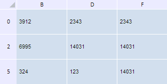

# TabSheet.showRows

TabSheet.showRows
-

**

# TabSheet.showRows

## Синтаксис

showRows(rowIndex: Number, count: Number);

## Параметры

*rowIndex.* Индекс первой отображаемой строки;

*count.* Количество отображаемых строк.

## Описание

Метод showRows** отображает скрытые строки таблицы.

## Пример

Для выполнения примера необходимо наличие на html-странице компонента [TabSheet](../../../Components/TabSheet/TabSheet/TabSheet.htm) с наименованием «tabSheet» (см. «[Пример создания компонента TabSheet](../../../Components/TabSheet/TabSheet/TabSheet_Example.htm)»). Скроем четыре строки, начиная со строки с индексом 1, и пять столбцов, начиная со столбца с индексом 0. Затем отобразим скрытую строку с индексом 2 и столбцы с индексами 1 и 3:

// Скроем четыре строки, начиная со строки с индексом 1
tabSheet.hideRows(1, 4);
// Скроем пять столбцов, начиная со столбца с индексом 0
tabSheet.hideColumns(0, 5);
// Отобразим скрытую строку с индексом 2
if (!tabSheet.isRowVisible(2)) {
    tabSheet.showRows(2, 1)
};
// Отобразим столбцы с индексами 1 и 3
if (!tabSheet.isColVisible(1)) {
    tabSheet.showColumns(1, 1)
};
if (!tabSheet.isColVisible(3)) {
    tabSheet.showColumns(3, 1)
};

В результате выполнения примера были скрыты четыре строки, начиная со строки с индексом 1, и пять столбцов, начиная со столбца с индексом 0, а затем были вновь отображены строка с индексом 2 и столбцы с индексами 1 и 3:

См. также:

[TabSheet](TabSheet.htm)

		Справочная
		 система на версию 10.9
		 от 18/08/2025,
		 © ООО «ФОРСАЙТ»,
