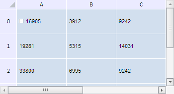

# TabSheet.sort

TabSheet.sort
-

**

# TabSheet.sort

## Синтаксис

sort(columnSettings: Object | Array, sortRange: PP.Ui.[TabSheetRange](../TabSheetRange/TabSheetRange.htm));

## Параметры

*columnSettings.* Параметр сортировки или массив параметров сортировок по нескольким столбцам в виде JSON-объекта {colIndex, order, comparer} или массив таких объектов, где colIndex - это индекс столбца сортировки, order - порядок сортировки ('asc' - по возрастанию, 'desc' - по убыванию), comparer - имеет значение «string», «number» или в виде определённой пользователем функции, возвращающей значения 0, 1, -1.

*sortRange.* Диапазон сортировки;

## Описание

Метод sort** сортирует таблицу по указанным столбцам таблицы.

## Пример

Для выполнения примера необходимо наличие на html-странице компонента [TabSheet](../../../Components/TabSheet/TabSheet/TabSheet.htm) с наименованием «tabSheet» (см. «[Пример создания компонента TabSheet](../../../Components/TabSheet/TabSheet/TabSheet_Example.htm)»). Отсортируем данные столбца с индексом 0 по убыванию их числовых значений:

// Определим параметры сортировки
var params = { colIndex: 0, order: "desc", comparer: "number" };
// Определим диапазон ячеек
var range = tabSheet.getRange(0, 0, 5, 5);
// Отсортируем данные столбца с индексом 0
tabSheet.sort(params, range);

В результате выполнения примера данные столбца с индексом 0 были отсортированы по убыванию их числовых значений:

См. также:

[TabSheet](TabSheet.htm)

		Справочная
		 система на версию 10.9
		 от 18/08/2025,
		 © ООО «ФОРСАЙТ»,
