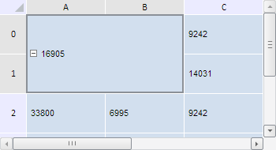

# TabSheet.splitSelectedRanges

TabSheet.splitSelectedRanges
-

**

# TabSheet.splitSelectedRanges

## Синтаксис

splitSelectedRanges();

## Описание

Метод splitSelectedRanges** разъединяет ячейки для всех выделенных диапазонов.

## Пример

Для выполнения примера необходимо наличие на html-странице компонента [TabSheet](../../../Components/TabSheet/TabSheet/TabSheet.htm) с наименованием «tabSheet» (см. «[Пример создания компонента TabSheet](../../../Components/TabSheet/TabSheet/TabSheet_Example.htm)»). Объединим ячейки в указанном диапазоне, выделим его и разъединим:

// Получим диапазон ячеек по заданным координатам
var range = tabSheet.getRange(0, 0, 1, 1);
// Объединим ячейки в указанном диапазоне
tabSheet.merge(range);
// Выделим диапазон ячеек
tabSheet.select(range);
var isSplit = confirm("Разъединить ячейки?");
if (isSplit) {
    // Разобъём диапазон объединенённых ячеек
    tabSheet.splitSelectedRanges(range)
};

В результате выполнения примера были объединены ячейки в диапазоне (0, 0) - (1, 1), а сами диапазон был выделен:

После этого был показан диалог, запрашивающий подтверждение на разъединение диапазона объединённых ячеек. В результате нажатия кнопки «OK» данный диапазон был разбит на отдельные ячейки:

См. также:

[TabSheet](TabSheet.htm)

		Справочная
		 система на версию 10.9
		 от 18/08/2025,
		 © ООО «ФОРСАЙТ»,
