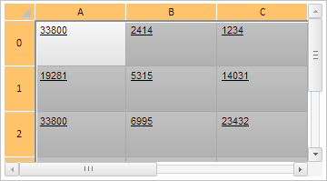
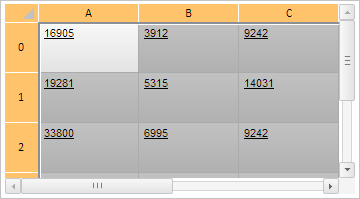

# TabSheet.unsort

TabSheet.unsort
-

# TabSheet.unsort

## Синтаксис

unsort(noRerender: Boolean);

## Параметры

noRerender. Признак отсутствия перерисовки компонента после выполнения метода.

## Описание

Метод unsort сбрасывает сортировку в таблице.

## Пример

Для выполнения примера необходимо наличие на html-странице компонента [TabSheet](../../../Components/TabSheet/TabSheet/TabSheet.htm) с наименованием «tabSheet» (см. «[Пример создания компонента TabSheet](../../../Components/TabSheet/TabSheet/TabSheet_Example.htm)»). Выделим и отсортируем все ячейки таблицы, применим настройки указанного CSS класса для всех ячеек таблицы:

// Выделим все ячейки таблицы
tabSheet.selectAll();
// Получим диапазоны выделеных ячеек
var ranges = tabSheet.getSelectedRanges();
// Отсортируем диапазон ячеек
tabSheet.sort({ colIndex: 2, order: "asc", comparer: "string" }, ranges[0]);
// Применим настройки указанного CSS класса для диапазона ячеек
tabSheet.setClassToRange(ranges, "PPRelease");

В результате все выделенные ячейки таблицы были отсортированы, также для них были установлены настройки указанного CSS класса:

Сбросим сортировку в таблице:

// Сбросим сортировку в таблице
tabSheet.unsort();

В результате были сброшены настройки сортировки ячеек в таблице:

См. также:

[TabSheet](TabSheet.htm)

		Справочная
		 система на версию 10.9
		 от 18/08/2025,
		 © ООО «ФОРСАЙТ»,
