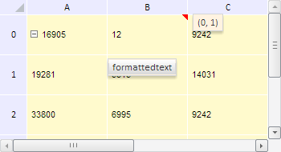

# Конструктор TabSheetCell

Конструктор TabSheetCell
-

**

# Конструктор TabSheetCell

## Синтаксис

PP.Ui.TabSheetCell(settings);

## Параметры

*settings.* JSON-объект
 со значениями свойств класса.

## Описание

Конструктор TabSheetCell**
 создает экземпляр класса **TabSheetCell.**

## Пример

Для выполнения примера необходимо наличие на html-странице компонента
 [TabSheet](../../../Components/TabSheet/TabSheet/TabSheet.htm)
 с наименованием «tabSheet» (см. «[Пример
 создания компонента TabSheet](../../../Components/TabSheet/TabSheet/TabSheet_Example.htm)»). Создадим новую ячейку таблицы с координатами
 (0, 1). Установим для неё новое значение, равное 12. Также для этой ячейки
 разрешим использовать форматы чисел при редактировании, зададим тип данных,
 установим для неё комментарий и всплывающую подсказу, изменим цвет заливки:

// Получаем модель таблицы
var model = tabSheet.getModel();
var oldCell = model.getCell(tabSheet.coord(0, 1));
// Создадим ячейку таблицы с координатами (0, 1)
var cell = new PP.Ui.TabSheetCell({
    Parent: model,
    Data: {
        L: 1, // Индекс столбца
        T: 0 // Индекс строки
    }
});
var coord = cell.getCoord();
if (cell.getIsEnabled()) {
    // Устанавливаем для ячейки комментарий
    cell.setComment("(" + coord.rowIndex + ", " + coord.colIndex + ")");
    // Устанавливаем для ячейки всплывающую подсказку
    cell.setHint(cell.getType());
    // Задаём стиль ячейки - цвет заливки делаем жёлтым
    var style = cell.getStyle();
    style.Fill.Color = "#FFFACD";
    // Устанавливаем стиль
    if (tabSheet.getChangedStyleBehavior()) {
        cell.setStyle(tabSheet.getChangedStyle().mergeStyle(style));
    }
    // Разрешаем использовать форматы чисел
    tabSheet.setUseNumberFormats(true);
    // Задаём тип данных ячейки Integer
    cell.setValueType(PP.Ui.TabSheetCellValueType.Integer);
    // Устанавливаем новое значение для ячейки
    cell.setValue(12);
}
// Обновляем таблицу
tabSheet.rerender();

В результате выполнения примера была создана ячейка модели таблицы с
 координатами (0, 1). Для неё было установлено значение, равное 12, задан
 тип Double, установлен комментарий и всплывающая подсказка, цвет заливки
 таблицы стал жёлтым:

См. также:

[TabSheetCell](TabSheetCell.htm)

		Справочная
		 система на версию 10.9
		 от 18/08/2025,
		 © ООО «ФОРСАЙТ»,
