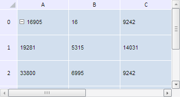

# TabSheetCell.IsDefault

TabSheetCell.IsDefault
-

**

# TabSheetCell.IsDefault

## Синтаксис

IsDefault: Boolean

## Описание

Свойство IsDefault** устанавливает
 ячейку модели по умолчанию.

## Комментарии

Значение свойства устанавливается из JSON и с помощью метода setIsDefault,
 а возвращается с помощью метода getIsDefault.

Значение данного свойства, равное true,
 говорит о том, что для данной ячейки не было метаданных в JSON-формате.
 Поэтому была сгенерировала ячейка по умолчанию. Иначе - свойство имеет
 значение false.

## Пример

Для выполнения примера необходимо наличие на html-странице компонента
 [TabSheet](../../../Components/TabSheet/TabSheet/TabSheet.htm)
 с наименованием «tabSheet» (см. «[Пример
 создания компонента TabSheet](../../../Components/TabSheet/TabSheet/TabSheet_Example.htm)»). Установим ячейке с координатами (0,
 1) строковое значение «16», сделаем данную ячейку доступной, если раннее
 она была недоступной, и отрисуем её для отображения изменений:

// Получаем модель таблицы
var model = tabSheet.getModel();
// Получим координаты
var coord = tabSheet.coord(0, 1);
// Получим ячейку по координате
var cell = model.getCell(coord);
// Открываем доступ к ячейке, если она его не имеет
if (!cell.getIsEnabled()) {
    cell.setEnabled(true)
};
cell.setIsDefault(false); // Ячейка не должна быть установлена по умолчанию
// Установим значение ячейке
cell.setRawValue("16");
/* Затем отрисуем данную ячейку */
// Получим измерения
var m = tabSheet.getMeasures();
var doc = document,
    css = PP.Ui.TabSheetCSS;
var iDiv, iiDiv, cellNode, cellToRender;
var container = null;
// Определим размер области, которая должна быть отрисована
var size = {
    height: m.getRowHeight(coord.rowIndex, true),
    width: m.getColumnWidth(coord.colIndex, true)
};
// Определяем, является ли данная ячейка ячейкой по умолчанию
var defaultCell = cell.getIsDefault();

В результате выполнения примера ячейке с координатами (0, 1) было
 установлено строковое значение «16», после чего она была отрисована:

См. также:

[TabSheetCell](TabSheetCell.htm)

		Справочная
		 система на версию 10.9
		 от 18/08/2025,
		 © ООО «ФОРСАЙТ»,
