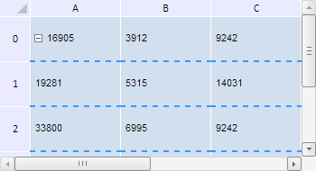

# Конструктор TabSheetCellBorderStyle

Конструктор TabSheetCellBorderStyle
-

**

# Конструктор TabSheetCellBorderStyle

## Синтаксис

PP.Ui.TabSheetCellBorderStyle**(settings);

## Параметры

*settings.* JSON-объект
 со значениями свойств класса.

## Описание

Конструктор **TabSheetCellBorderStyle**
 создает экземпляр класса **TabSheetCellBorderStyle.**

## **Комментарии**

В веб-приложении не поддерживается отображение диагональных границ ячейки.

## Пример

Для выполнения примера необходимо наличие на html-странице компонента
 [TabSheet](../../../Components/TabSheet/TabSheet/TabSheet.htm)
 с наименованием «tabSheet» (см. «[Пример
 создания компонента TabSheet](../../../Components/TabSheet/TabSheet/TabSheet_Example.htm)»). Создадим новый стиль для нижней границы
 ячеек таблицы:

// Получаем модель таблицы
var model = tabSheet.getModel();
// Получаем стиль по умолчанию
var style = model.getDefaultStyle();
// Получаем массив границ таблицы
var borders = style.Borders;
// Создаём новый стиль для нижней границы ячеек таблицы
var border = new PP.Ui.TabSheetCellBorderStyle({
    Data: {
        "@C": "#3399FF", // Голубой цвет
        "@I": PP.Ui.TabSheetCellBorderIndex.EdgeBottom, // Нижняя граница ячеек
        "@S": PP.Ui.TabSheetCellBorderLineStyle.Dash, // Пунктирный стиль линии
        "@W": PP.Ui.TabSheetCellBorderWeight.Medium, // Средний размер линии
    }
});
// Устанавливаем новый стиль
borders[PP.Ui.TabSheetCellBorderIndex.EdgeBottom] = border;
// Обновляем таблицу
tabSheet.rerender();

В результате выполнения примера для нижней границы ячеек таблицы был
 создан новый стиль. После его применения таблица стала выглядеть следующим
 образом:

См. также:

[TabSheetCellBorderStyle](TabSheetCellBorderStyle.htm)

		Справочная
		 система на версию 10.9
		 от 18/08/2025,
		 © ООО «ФОРСАЙТ»,
