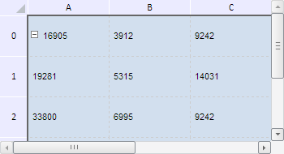

# TabSheetCellBorderStyle.Color

TabSheetCellBorderStyle.Color
-

**

# TabSheetCellBorderStyle.Color

## Синтаксис

Color: String

## Описание

Свойство Color** определяет
 цвет границы ячеек.

## Комментарии

Значение свойства возвращается с помощью метода getColor.
 Из JSON значение задается используя подстановку "@C" в объекте
 Data (см. [конструктор
 TabSheetCellBorderStyle](Constructor_TabSheetCellBorderStyle.htm)).

По умолчанию значение свойства равно строке «#FFFFFF», что соответствует
 белому цвету.

## Пример

Для выполнения примера необходимо наличие на html-странице компонента
 [TabSheet](../../../Components/TabSheet/TabSheet/TabSheet.htm)
 с наименованием «tabSheet» (см. «[Пример
 создания компонента TabSheet](../../../Components/TabSheet/TabSheet/TabSheet_Example.htm)»). Установим для ячеек таблицы цвет,
 толщину, ширину и стиль границ:

// Получаем модель таблицы
var model = tabSheet.getModel();
// Получаем стиль по умолчанию
var style = model.getDefaultStyle();
// Получаем массив границ таблицы
var borders = style.Borders;
for (var i in borders) {
    var border = borders[i];
    if (border.hasIndex(PP.Ui.TabSheetCellBorderIndex.EdgeTop) | border.hasIndex(PP.Ui.TabSheetCellBorderIndex.EdgeLeft)) {
        // Установим цвет границы, смежной с заголовками строк и столбцов
        border.setColor("#666666");
        // Устанавливаем толщину границы, смежной с заголовками строк и столбцов
        border.setRawWeight(PP.Ui.TabSheetCellBorderWeight.Medium);
        if (border.hasIndex(PP.Ui.TabSheetCellBorderIndex.EdgeTop)) {
            // Получим информацию о границе, смежной с заголовком столбцов таблицы
            console.log("Информация о границе, смежной с заголовком столбцов таблицы:");
            console.log("Толщина: " + border.getWeight(PP.Ui.TabSheetCellBorderIndex.EdgeTop));
            console.log("Индекс: " + border.getIndex());
            console.log("CSS: \"" + border.toCSS(PP.Ui.TabSheetCellBorderIndex.EdgeTop) + "\"")
        }
    } else {
        // Установим цвет границы ячеек
        border.setColor("#CCCCCC");
        // Устанавливаем стиль границы ячеек
        border.setStyle(PP.Ui.TabSheetCellBorderLineStyle.Dash);
    }
}
// Перерисовываем таблицу
tabSheet.rerender();

В результате выполнения примера для границы, смежной с заголовками строк
 и столбцов таблицы, был установлен тёмно-серый цвет, увеличена толщина
 до значения, равного 2. Цвет остальных границ ячеек был изменён на светло-серый,
 а также установлен пунктирный стиль линии:

Отдельно для границы, смежной с заголовком столбцов таблицы, в консоли
 браузера была выведена информация о её толщине, индексе, а также строка
 соответствующего ей CCS-стиля:

Информация о границе, смежной с заголовком столбцов
 таблицы:

Толщина: 2

Индекс: 2

CSS: "border-top: 2px solid #666666"

См. также:

[TabSheetCellBorderStyle](TabSheetCellBorderStyle.htm)

		Справочная
		 система на версию 10.9
		 от 18/08/2025,
		 © ООО «ФОРСАЙТ»,
