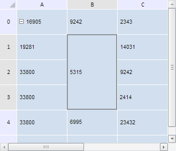

# Конструктор TabSheetCellSpan

Конструктор TabSheetCellSpan
-

**

# Конструктор TabSheetCellSpan

## Синтаксис

PP.Ui.TabSheetCellSpan(settings);

## Параметры

*settings.* JSON-объект
 со значениями свойств класса.

## Описание

Конструктор TabSheetCellSpan**
 создает экземпляр класса **TabSheetCellSpan.**

## Пример

Для выполнения примера необходимо наличие на html-странице компонента
 [TabSheet](../../../Components/TabSheet/TabSheet/TabSheet.htm)
 с наименованием «tabSheet» (см. «[Пример
 создания компонента TabSheet](../../../Components/TabSheet/TabSheet/TabSheet_Example.htm)»). Создадим диапазон объединённых ячеек,
 очистим границы, выделим и получим информацию о нём - размеры в пикселях
 и в количестве строк и столбцов, входящих в него:

// Получим диапазон ячеек по заданным координатам
var range = tabSheet.getRange(1, 0, 1, 2);
// Разъединим ячейки диапазона
range.split();
var cellSpan;
// Определим модель таблицы
var model = tabSheet.getModel();
// Определим координаты углов диапазона
var corners = range.getCorners();
// Определим размер диапазона в пикселях
var size = range.getSizeInVirtualCells();
//
if (range.getCoordsCount() > 1) {
    // Создадим диапазон объединённых ячеек
    cellSpan = new PP.Ui.TabSheetCellSpan({
        Data: {
            "@T": corners.tlCoord.rowIndex,
            "@L": corners.tlCoord.colIndex,
            "@W": size.columnsCount - 1,
            "@H": size.rowsCount - 1
        }
    });
    // Добавим диапазон объединённых ячеек в модель
    model.addCellSpan(cellSpan);
}
// Установим новый размер таблицы
tabSheet.setHeight(300);
// Очистим границы диапазона объединенных ячеек
cellSpan.clear();
// Обновим таблицу
tabSheet.rerender();
// Выделим диапазон объединённых ячеек
tabSheet.select(cellSpan.getRange(tabSheet));
// Получим координаты диапазона объединенных ячеек
console.log("Ячейка с координатами (" + cellSpan.getCoord().colIndex + "," + cellSpan.getCoord().rowIndex + ")");
// Определим размеры диапазона объединенных ячеек в пикселях
var sizeInPX = cellSpan.getVisibleSize(tabSheet);
console.log("Ширина: " + sizeInPX.width + "; высота: " + sizeInPX.height);
// Определим размеры диапазона в ячейках
var sizeInCells = cellSpan.getSizeCoord();
console.log("Количество столбцов: " + --sizeInCells.column + "; количество строк: " + --sizeInCells.row);
// Определим, входят ли координаты (0, 1) в диапазон объединенных ячеек
var coord = tabSheet.coord(0, 1)
if (cellSpan.isCoordInSpan(coord)) {
    console.log("Координата (" + coord.rowIndex + ", " + coord.colIndex + ") входит в диапазон объединенных ячеек.");
} else {
    console.log("Координата (" + coord.rowIndex + ", " + coord.colIndex + ") не входит в диапазон объединенных ячеек.");
};

В результате выполнения примера был создан диапазон объединенных ячеек.
 Он был сдвинут на одну строку вниз, очищен и выделен:

Размеры данного диапазона в пикселях и в количестве строк и столбцов,
 входящих в него, были выведены в консоли браузера. Также определили, входят
 ли в этот диапазон координаты (1, 2):

Ячейка с координатами (1,1)

Ширина: 98; высота: 148

Количество столбцов: 1; количество строк: 3

Координата (0, 1) не входит в диапазон объединенных ячеек.

См. также:

[TabSheetCellSpan](TabSheetCellSpan.htm)

		Справочная
		 система на версию 10.9
		 от 18/08/2025,
		 © ООО «ФОРСАЙТ»,
