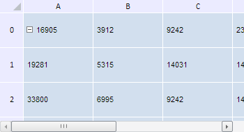

# Конструктор TabSheetCellStyle

Конструктор TabSheetCellStyle
-

**

# Конструктор TabSheetCellStyle

## Синтаксис

PP.Ui.TabSheetCellStyle(settings);

## Параметры

*settings.* JSON-объект
 со значениями свойств класса.

## Описание

Конструктор TabSheetCellStyle**
 создает экземпляр класса **TabSheetCellStyle.**

## Комментарии

В веб-приложении не поддерживается отображение диагональных границ ячейки.

## Пример

Для выполнения примера необходимо наличие на html-странице компонента
 [TabSheet](../../../Components/TabSheet/TabSheet/TabSheet.htm)
 с наименованием «tabSheet» (см. «[Пример
 создания компонента TabSheet](../../../Components/TabSheet/TabSheet/TabSheet_Example.htm)»). Создадим экземпляр класса TabSheetCellStype
 на основе стиля по умолчанию, укажем для ячеек таблицы права полного доступа
 и установим созданный объект в качестве стиля для таблицы. Затем получим
 информацию о стилях гиперссылок и границах, смежных с заголовками таблицы,
 а также преобразуем строку со значениями отступов в массив чисел:

// Получаем модель таблицы
var model = tabSheet.getModel();
// Получаем JSON-объект стиля
var json = model.getDefaultStyle().toJSON();
// Создадим новый стиль на базе стиля по умолчанию
var style = new PP.Ui.TabSheetCellStyle({
    Data: json,
});
// Установим права полного доступа
style.setAccessRights(PP.Ui.TabSheetAccessRights.FullAccess);
// Будем отображать значки, обозначающие права доступа к ячейкам таблицы
tabSheet.setDisplayAccessRights(true);
// Установим стиль таблицы
tabSheet.setStyle(style);
tabSheet.rerender();
// Получим информацию о границе, смежной с заголовком строк таблицы
var border1 = style.getBorderByIndex(PP.Ui.TabSheetCellBorderIndex.EdgeLeft);
console.log("Тип объекта границы: " + border1.getTypeName());
// Получим второй объект границы
var border2 = style.getBorders[1];
console.log(border2.toJSON());

В результате выполнения примера таблице будет задан новый стиль, основанный
 на стиле по умолчанию:

В консоли браузера будет выведена информация о границах ячеек.

См. также:

[TabSheetCellStyle](TabSheetCellStyle.htm)

		Справочная
		 система на версию 10.9
		 от 18/08/2025,
		 © ООО «ФОРСАЙТ»,
