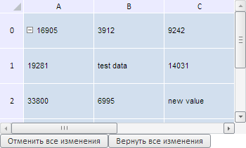
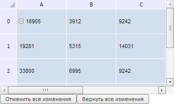

# TabSheetChange.getAction

TabSheetChange.getAction
-

**

# TabSheetChange.getAction

## Синтаксис

getAction();

## Описание

Метод getAction** возвращает тип команды.

## Комментарии

Метод возвращает значение «remove», если ячейка таблицы была удалена, «add» - если была добавлена и «edit» - если были отредактированы её данные.

## Пример

Для выполнения примера необходимо наличие на html-странице компонента [TabSheet](../../../Components/TabSheet/TabSheet/TabSheet.htm) с наименованием «tabSheet» (см. «[Пример создания компонента TabSheet](../../../Components/TabSheet/TabSheet/TabSheet_Example.htm)»). Изменим значения двух ячеек, а затем выведем тип выполненной команды, старое и новое их значения. Также добавим две кнопки - для отмены всех изменений и для возврата изменений назад:

// Внесем изменения в данные ячеек
tabSheet.setCellValue("test data", 1, 1);
tabSheet.setCellValue("new value", 2, 2);
// Выведем измененные данные
var changedData = tabSheet.getChangedData();
// Пройдём по всем измененным ячейкам
for (var i in changedData) {
    var data = changedData[i];
    // Получим старое значение ячейки
    var oldValue = data.getOldValue();
    // Получим новое значение
    var newValue = data.getNewValue();
    // Получим координаты измененной ячейки
    var coord = " (" + oldValue.getCoord().rowIndex + ", " + oldValue.getCoord().colIndex + ")";
    console.log("Над ячейкой" + coord + " было произведено действие '" + data.getAction() + "'");
    console.log("Старое значение ячейки" + coord + ": " + oldValue.CellData.FormattedText);
    console.log("Новое значение ячейки" + coord + ": " + newValue.CellData.FormattedText);
}
// По кнопке «Отменить все изменения» отменяем все изменения
var tempButton1 = new PP.Ui.Button({
    ParentNode: document.body,
    Id: "tempButton1",
    ResourceKey: "tempButton1",
    Content: "Отменить все изменения",
    Click: function btnOnClick() {
        var changedData = tabSheet.getChangedData();
        for (var i in changedData) {
            // Отменим все изменения
            changedData[i].undo()
        }
    }
});
// По кнопке «Вернуть все изменения» возвратим все изменения назад
var tempButton2 = new PP.Ui.Button({
    ParentNode: document.body,
    Id: "tempButton2",
    ResourceKey: "tempButton2",
    Content: "Вернуть все изменения",
    Click: function btnOnClick() {
        var changedData = tabSheet.getChangedData();
        for (var i in changedData) {
            // Возвращаем все изменения
            changedData[i].redo()
        }
    }
});

В результате выполнения примера были изменены значения двух ячеек и добавлены две кнопки - для отмены всех изменений и для возврата изменений назад:

При этом в консоли браузера были выведены тип выполненного действия, старое и новое значения отредактированных ячеек:

Над ячейкой (1, 1) было произведено действие 'edit'

Старое значение ячейки (1, 1): 5315

Новое значение ячейки (1, 1): test data

Над ячейкой (2, 2) было произведено действие 'edit'

Старое значение ячейки (2, 2): 9242

Новое значение ячейки (2, 2): new value

При нажатии на кнопку «Отменить все изменения» будут отменены все совершённые изменения:

Если нажмём на кнопку «Вернуть все изменения», то, соответственно, будут возвращены все изменения:

См. также:

[TabSheetChange](TabSheetChange.htm)

		Справочная
		 система на версию 10.9
		 от 18/08/2025,
		 © ООО «ФОРСАЙТ»,
