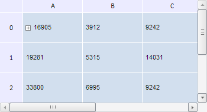

# TabSheetChange.getContext

TabSheetChange.getContext
-

**

# TabSheetChange.getContext

## Синтаксис

getContext();

## Описание

Метод getContext** возвращает контекст команды.

## Пример

Для выполнения примера необходимо наличие на html-странице компонента [TabSheet](../../../Components/TabSheet/TabSheet/TabSheet.htm) с наименованием «tabSheet» (см. «[Пример создания компонента TabSheet](../../../Components/TabSheet/TabSheet/TabSheet_Example.htm)»). Получим кнопку развёртывания и с помощью неё скроем группу ячеек таблицы. Затем получим массив измененных данных ячеек, из которого определим тип контекста команд, координаты изменённых ячеек и признак того, свёрнут ли диапазон таблицы:

// Получим кнопку развёртывания таблицы
var expander = tabSheet.getModel().getExpanders()[0];
// Автоматически будем скрывать строки и столбцы ячеек
tabSheet.setEmulateExpanderAction(true);
// Скрываем группу
expander.collapse();
// Получим массив измененных данных
var changedData = tabSheet.getChangedData();
// Цикл, проходящий через все измененные ячейки
for (var i in changedData) {
    var data = changedData[i];
    // Получим контекст текущего объекта изменения
    var context = data.getContext();
    // Получим координаты измененной ячейки из контекста
    var coord = context.getSettings().Coord;
    console.log("Тип контекста команды: " + context.getTypeName()+ ".");
    console.log("Координаты измененной ячейки: (" + coord.colIndex + ", " + coord.rowIndex + ").");
    var isCollapsed = data.getTabSheet().getModel().getExpanders()[0].getIsCollapsed();
    console.log("Диапазон ячеек " + (isCollapsed ? "свёрнут." : "развёрнут."))
};

В результате выполнения примера группа ячеек была свёрнута:

При этом в консоли браузера были выведены тип контекста команды, координаты изменённой ячейки, а также определено, свёрнут ли диапазон ячеек:

Тип контекста команды: PP.Ui.TabSheetExpander.

Координаты измененной ячейки: (0, 0).

Диапазон ячеек свёрнут.

См. также:

[TabSheetChange](TabSheetChange.htm)

		Справочная
		 система на версию 10.9
		 от 18/08/2025,
		 © ООО «ФОРСАЙТ»,
