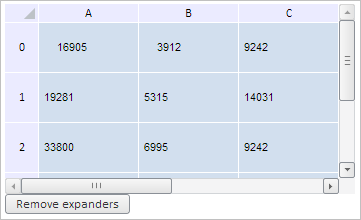

# Конструктор TabSheetExpander

Конструктор TabSheetExpander
-

**

# Конструктор TabSheetExpander

## Синтаксис

PP.Ui.TabSheetExpander(settings);

## Параметры

*settings.* JSON-объект
 со значениями свойств компонента.

## Описание

Конструктор TabSheetExpander**
 создает экземпляр компонента **TabSheetExpander.**

## Пример

Для выполнения примера необходимо наличие на html-странице компонента
 [TabSheet](../../../Components/TabSheet/TabSheet/TabSheet.htm)
 с наименованием «tabSheet» (см. «[Пример
 создания компонента TabSheet](../../../Components/TabSheet/TabSheet/TabSheet_Example.htm)»). Получим существующую группировку и
 создадим новую группировку в ячейке с координатами (0, 1), с шириной и
 высотой, равными одному столбцу и одной строке соответственно, при необходимости
 развернём её. Сравним обе группировки, проверим их вложенность, пересечение.
 Реализуем также кнопку для их удаления:

// Получим модель данных таблицы
var model = tabSheet.getModel();
// Получим существующую группировку ячеек таблицы
var expander1 = model.getExpanders()[0];
// Получим координаты левой верхней ячейки в полученной группировке
var coord = expander1.getCoord();
console.log("Координаты первой группировки: (" + coord.colIndex + ", " + coord.rowIndex + ")");
// Создадим новую группировку ячеек
var expander2 = new PP.Ui.TabSheetExpander({
    Data: {
        "@T": 0, // Индекс верхней строки группировки
        "@L": 1, // Индекс левого столбца группировки
        "@H": 1, // Высота группировки
        "@W": 1, // Ширина группировки
    },
    Parent: tabSheet
});
/* Добавим созданную группировку в таблицу и
   отключим проверку на вложенность диапазонов для данных группировок */
tabSheet.addExpander(expander2, true);
//  Равернём вторую группировку, если она свёрнута
if (expander2.getIsCollapsed()) {
    expander2.expand()
}
// Получим координаты левой верхней ячейки в созданной группировке
coord = expander2.getCoord();
console.log("Координаты второй группировки: (" + coord.colIndex + ", " + coord.rowIndex + ")");
// Получим индексы строк и столбцов, которые скрываются при сворачивании
var indexExp = expander2.getIndexesToExpand();
console.log("Для второй группировки скрыты строки со следующими индексами: " + indexExp.rows);
console.log("Для второй группировки скрыты столбцы со следующими индексами: " + indexExp.rows);
// Получим количество строк и столбцов во второй группировке
var sizeCoord = expander2.getSizeCoord();
console.log("Количество столбцов: " + (sizeCoord.column - 2) + "; количество строк: " + (sizeCoord.row - 2));
// Обновим таблицу
expander2.getTabSheet().rerender();
// Сравним между собой обе группировки
if (!expander1.equals(expander2)) {
    // Проверим, вложена ли вторая группировка ячеек таблицы в первую
    var isContains = expander1.contains(expander2);
    if (isContains) {
        // Получим вложенные группировки
        var innerExpanders = expander1.getInnerExpanders();
        if (innerExpanders != null) {
            // Получим количество группировок, вложенных в первую
            console.log("Количество вложенных группировок: " + expander1.getInnerExpanders().length)
        }
    };
    // Проверим пересекаются ли группировки
    var isCrossWith = expander1.isCrossWith(expander2);
    console.log("Группировки таблицы " + (!isCrossWith ? "не " : "") + "пересекаются.")
};
// Определим, входят ли координаты (0, 1) в первую группировку
var coord = tabSheet.coord(0, 1)
var isCoordInside = expander1.isCoordInside(coord);
console.log("Координаты (0, 1) " + (!isCoordInside ? "не " : "") + "входят в первую группировку.");
// По нажатию по кнопке «Remove expanders» удалим все группировки в таблице
var tempButton1 = new PP.Ui.Button({
    ParentNode: document.body,
    Id: "removeExpandersButton",
    ResourceKey: "removeExpandersButton",
    Content: "Remove expanders",
    Click: function () {
        // Удалим все группировки ячеек таблицы
        model.eachExpander(function (expander) {
            expander.remove(true, true)
        }, this)
    }
});

В результате выполнения примера была создана новая группировка в ячейке
 с координатами (0, 1), с шириной и высотой, равными одному столбцу и одной
 строке соответственно. Также была создана кнопка для их удаления:

В консоли браузера были выведены координаты левой верхней ячейки группировок,
 индексы скрытых строк и столбцов второй группировки, а также её размер,
 выраженный в количестве строк и столбцов. Также было определено, пересекаются
 ли группировки и входят ли координаты (0, 1) в первую из них:

Координаты первой группировки: (0, 0)

Координаты второй группировки: (1, 0)

Для второй группировки скрыты строки со следующими индексами: 1

Для второй группировки скрыты столбцы со следующими индексами: 1

Количество столбцов: 1; количество строк: 1

Группировки таблицы пересекаются.

Координаты (0, 1) входят в первую группировку.

Нажмём на кнопку «Remove expanders», тем самым удалив обе группировки:

См. также:

[TabSheetExpander](TabSheetExpander.htm)

		Справочная
		 система на версию 10.9
		 от 18/08/2025,
		 © ООО «ФОРСАЙТ»,
