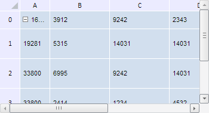

# TabSheetMeasures.ColumnWidth

TabSheetMeasures.ColumnWidth
-

**

# TabSheetMeasures.ColumnWidth

## Синтаксис

ColumnWidth: Number

## Описание

Свойство ColumnWidth** определяет ширину указанного столбца таблицы.

## Комментарии

Значение свойства устанавливается с помощью метода setColumnWidth и возвращается при помощи метода getColumnWidth. Из JSON значение свойства задать нельзя.

При вызове метода setColumnWidth указываются два параметра: value - новое значение ширины столбца и colIndex - индекс данного столбца.

При вызове метода getColumnWidth указываются два параметра: colIndex - индекс столбца таблицы, значение ширины которого необходимо возвратить, isVirtual - признак, показывающий, обращаемся ли мы к виртуальному столбцу таблицы или к реальному.

## Пример

Для выполнения примера необходимо наличие на html-странице компонента [TabSheet](../../../Components/TabSheet/TabSheet/TabSheet.htm) с наименованием «tabSheet» (см. «[Пример создания компонента TabSheet](../../../Components/TabSheet/TabSheet/TabSheet_Example.htm)»). Изменим ширину первого столбца и высоту первой строки таблицы, а также разрешим отображение значков прав доступа к ячейкам:

// Получим измерения таблицы
var measures = tabSheet.getMeasures();
// Изменим ширину колонки с индексом 0
measures.setColumnWidth(50,0);
// Изменим высоту строки с индексом 0
measures.setRowHeight(30,0);
// Разрешим отображение значков прав доступа к ячейкам таблицы
measures.setDisplayAccessRights(true);
// Перерисуем таблицу
tabSheet.rerender();

В результате выполнения примера была изменена ширина первого столбца и высота первой строки таблицы:

См. также:

[TabSheetMeasures](TabSheetMeasures.htm)

		Справочная
		 система на версию 10.9
		 от 18/08/2025,
		 © ООО «ФОРСАЙТ»,
