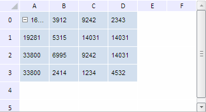

# TabSheetMeasures.DefaultColumnWidth

TabSheetMeasures.DefaultColumnWidth
-

**

# TabSheetMeasures.DefaultColumnWidth

## Синтаксис

DefaultColumnWidth: Number

## Описание

Свойство DefaultColumnWidth** устанавливает для столбцов таблицы ширину по умолчанию.

## Комментарии

Значение свойства можно установить из JSON и с помощью метода setDefaultColumnWidth, а возвратить - с помощью метода getDefaultColumnWidth.

По умолчанию ширина столбцов таблицы равна 70 пикселям.

## Пример

Для выполнения примера необходимо наличие на html-странице компонента [TabSheet](../../../Components/TabSheet/TabSheet/TabSheet.htm) с наименованием «tabSheet» (см. «[Пример создания компонента TabSheet](../../../Components/TabSheet/TabSheet/TabSheet_Example.htm)»). Установим новые значения по умолчанию для ширины столбцов и высоты строк таблицы:

// Получим измерения таблицы
var measures = tabSheet.getMeasures();
// Изменим значение ширины колонок по умолчанию
measures.setDefaultColumnWidth(50);
// Изменим значение высоты строк по умолчанию
measures.setDefaultRowHeight(30);
// Перерисуем таблицу
tabSheet.rerender();

В результате выполнения примера была изменена ширина столбцов и высота строк таблицы:

См. также:

[TabSheetMeasures](TabSheetMeasures.htm)

		Справочная
		 система на версию 10.9
		 от 18/08/2025,
		 © ООО «ФОРСАЙТ»,
