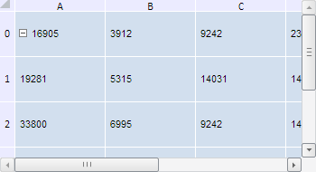

# TabSheetMeasures.HeaderHeight

TabSheetMeasures.HeaderHeight
-

**

# TabSheetMeasures.HeaderHeight

## Синтаксис

HeaderHeight: Number

## Описание

Свойство HeaderHeight** устанавливает высоту заголовков столбцов таблицы.

## Комментарии

Значение свойства можно установить из JSON и с помощью метода setHeaderHeight, а возвратить - с помощью метода getHeaderHeight.

По умолчанию высота заголовков столбцов таблицы равна 18.

## Пример

Для выполнения примера необходимо наличие на html-странице компонента [TabSheet](../../../Components/TabSheet/TabSheet/TabSheet.htm) с наименованием «tabSheet» (см. «[Пример создания компонента TabSheet](../../../Components/TabSheet/TabSheet/TabSheet_Example.htm)»). Изменим значение высоты заголовков столбцов и ширины заголовков строк таблицы:

// Получим измерения таблицы
var measures = tabSheet.getMeasures();
// Изменим значение высоты заголовков столбцов
measures.setHeaderHeight(12);
// Изменим значение ширины заголовков строк
measures.setRowHeaderWidth(16);
// Перерисуем таблицу
tabSheet.rerender();

В результате выполнения примера высота заголовков столбцов таблицы стала равна 12 пикселям, а ширина заголовков строк - 16 пикселям:

См. также:

[TabSheetMeasures](TabSheetMeasures.htm)

		Справочная
		 система на версию 10.9
		 от 18/08/2025,
		 © ООО «ФОРСАЙТ»,
